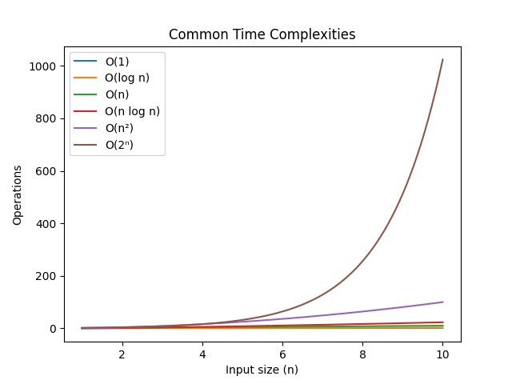

# Introduction to Data Structures & Algorithms

## Data Types, Data Structures, and Abstract Data Types

### Data Types
A data type defines the type of value a variable can hold and the operations that can be performed on it. In Python, common data types include:

- **Primitive types**: `int`, `float`, `bool`, `str`
- **Composite types**: `list`, `tuple`, `dict`, `set`

```python
# Examples of data types in Python
integer_var = 42
float_var = 3.14
boolean_var = True
string_var = "Hello, World!"
list_var = [1, 2, 3]
tuple_var = (1, 2, 3)
dict_var = {'name': 'Alice', 'age': 25}
set_var = {1, 2, 3}
```

### Data Structures
Data structures are ways to organize and store data in a computer so that it can be accessed and modified efficiently. They define the relationship between data and the operations that can be performed on the data.

Common data structures include:

- Arrays/Lists
- Stacks
- Queues
- Linked Lists
- Trees
- Graphs
- Hash Tables

```python
# Example of using a list as a stack
stack = []
stack.append(1)  # push
stack.append(2)
stack.append(3)
print(stack.pop())  # pops 3
print(stack.pop())  # pops 2

# Example of using a list as a queue (inefficient, collections.deque is better)
queue = []
queue.append(1)  # enqueue
queue.append(2)
queue.append(3)
print(queue.pop(0))  # dequeue - pops 1
print(queue.pop(0))  # dequeue - pops 2
```

### Abstract Data Types (ADTs)
An ADT is a mathematical model for data types that defines the type's behavior from the user's perspective, independent of implementation. It specifies what operations are possible but not how they're implemented.

Common ADTs:

- List ADT
- Stack ADT
- Queue ADT
- Map/Dictionary ADT
- Set ADT

```python
# Implementing a Stack ADT using a class
class Stack:
    def __init__(self):
        self.items = []
    
    def push(self, item):
        self.items.append(item)
    
    def pop(self):
        if not self.is_empty():
            return self.items.pop()
        return None
    
    def peek(self):
        if not self.is_empty():
            return self.items[-1]
        return None
    
    def is_empty(self):
        return len(self.items) == 0
    
    def size(self):
        return len(self.items)

# Usage
s = Stack()
s.push(10)
s.push(20)
print(s.pop())  # 20
print(s.peek())  # 10
```

## Dynamic Memory Allocation

Dynamic memory allocation is the process of assigning memory space during runtime rather than at compile time. In Python, memory management is handled automatically, but understanding the concept is important.

Key concepts:

- **Heap memory**: Where dynamically allocated memory resides
- **Memory allocation**: `malloc` in C, `new` in Java/C++, automatic in Python
- **Memory deallocation**: `free` in C, automatic garbage collection in Python

```python
# Python handles memory allocation automatically
# Creating a large list dynamically
dynamic_list = [x for x in range(1000000)]  # Allocates memory for 1 million elements

# Memory management with objects
class Node:
    def __init__(self, data):
        self.data = data
        self.next = None

# Creating linked nodes dynamically
node1 = Node(10)  # Memory allocated for node1
node2 = Node(20)  # Memory allocated for node2
node1.next = node2  # Linking nodes

# Python's garbage collector will automatically free memory when objects are no longer referenced
```

## Introduction to Algorithms

An algorithm is a finite sequence of well-defined instructions to solve a problem or perform a computation.

Algorithm properties:

1. **Input**: Zero or more inputs
2. **Output**: At least one output
3. **Definiteness**: Clear, unambiguous instructions
4. **Finiteness**: Must terminate after finite steps
5. **Effectiveness**: Each step must be basic enough to be done exactly in finite time

```python
# Example: Linear Search Algorithm
def linear_search(arr, target):
    """
    Input: arr - list of elements
           target - element to search for
    Output: index of target if found, -1 otherwise
    """
    for i in range(len(arr)):
        if arr[i] == target:
            return i
    return -1

# Example usage
numbers = [4, 2, 7, 1, 9, 5]
print(linear_search(numbers, 7))  # Output: 2 (index of 7)
print(linear_search(numbers, 3))  # Output: -1 (not found)

# Example: Bubble Sort Algorithm
def bubble_sort(arr):
    n = len(arr)
    for i in range(n):
        # Last i elements are already in place
        for j in range(0, n-i-1):
            if arr[j] > arr[j+1]:
                # Swap if element is greater than next
                arr[j], arr[j+1] = arr[j+1], arr[j]
    return arr

# Example usage
unsorted = [64, 34, 25, 12, 22, 11, 90]
print("Sorted array:", bubble_sort(unsorted))
```

## Asymptotic Notations and Common Functions

Asymptotic notations are mathematical tools to describe the running time or space complexity of algorithms as the input size grows.

### Big-O Notation (O)
Describes the upper bound of an algorithm's running time (worst-case scenario).

Common time complexities:

1. **O(1)**: Constant time
2. **O(log n)**: Logarithmic time
3. **O(n)**: Linear time
4. **O(n log n)**: Linearithmic time
5. **O(n²)**: Quadratic time
6. **O(2ⁿ)**: Exponential time

```python
# O(1) - Constant time
def get_first_element(arr):
    return arr[0] if arr else None

# O(n) - Linear time
def find_max(arr):
    max_val = arr[0]
    for num in arr:
        if num > max_val:
            max_val = num
    return max_val

# O(n²) - Quadratic time
def print_all_pairs(arr):
    for i in arr:
        for j in arr:
            print(i, j)

# O(log n) - Binary search example
def binary_search(sorted_arr, target):
    low = 0
    high = len(sorted_arr) - 1
    
    while low <= high:
        mid = (low + high) // 2
        if sorted_arr[mid] == target:
            return mid
        elif sorted_arr[mid] < target:
            low = mid + 1
        else:
            high = mid - 1
    return -1

# O(n log n) - Merge sort example
def merge_sort(arr):
    if len(arr) > 1:
        mid = len(arr) // 2
        left = arr[:mid]
        right = arr[mid:]
        
        merge_sort(left)
        merge_sort(right)
        
        i = j = k = 0
        
        while i < len(left) and j < len(right):
            if left[i] < right[j]:
                arr[k] = left[i]
                i += 1
            else:
                arr[k] = right[j]
                j += 1
            k += 1
        
        while i < len(left):
            arr[k] = left[i]
            i += 1
            k += 1
        
        while j < len(right):
            arr[k] = right[j]
            j += 1
            k += 1
    return arr
```

### Omega Notation (Ω)
Describes the lower bound of an algorithm's running time (best-case scenario).

### Theta Notation (Θ)
Describes both upper and lower bounds, providing a tight bound.

### Common Functions in Algorithm Analysis
1. **Constant function**: f(n) = c
2. **Logarithmic function**: f(n) = log n
3. **Linear function**: f(n) = n
4. **Linearithmic function**: f(n) = n log n
5. **Quadratic function**: f(n) = n²
6. **Cubic function**: f(n) = n³
7. **Exponential function**: f(n) = 2ⁿ

```python
# Comparing growth rates
import math
import matplotlib.pyplot as plt
import numpy as np

n = np.linspace(1, 10, 100)
plt.plot(n, np.ones(len(n)), label='O(1)')
plt.plot(n, np.log(n), label='O(log n)')
plt.plot(n, n, label='O(n)')
plt.plot(n, n * np.log(n), label='O(n log n)')
plt.plot(n, n**2, label='O(n²)')
plt.plot(n, 2**n, label='O(2ⁿ)')
plt.legend()
plt.xlabel('Input size (n)')
plt.ylabel('Operations')
plt.title('Common Time Complexities')
plt.savefig('time_complexities.png')
plt.show()
```
[](time_complexities.png)
