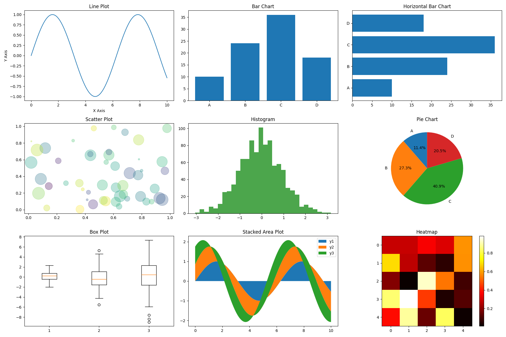

# Data Visualization using Matplotlib

Matplotlib is a comprehensive library for creating static, animated, and interactive visualizations in Python. Below is a complete guide covering various types of graphs with explanations, syntax, and example code.

## Table of Contents
1. [Line Plot](#line-plot)
2. [Bar Chart](#bar-chart)
3. [Histogram](#histogram)
4. [Scatter Plot](#scatter-plot)
5. [Pie Chart](#pie-chart)
6. [Box Plot](#box-plot)
7. [Violin Plot](#violin-plot)
8. [Heatmap](#heatmap)
9. [Area Plot](#area-plot)
10. [3D Plotting](#3d-plotting)

```python exec="on"
# Fix the area plot error: we need to provide y-values as a list of arrays, not individual arguments
# Re-create the full chart layout
import matplotlib.pyplot as plt
import numpy as np
import pandas as pd

# Sample data
x = np.linspace(0, 10, 100)
y = np.sin(x)
categories = ['A', 'B', 'C', 'D']
values = [10, 24, 36, 18]

fig, axs = plt.subplots(3, 3, figsize=(18, 12))

# Line Plot
axs[0, 0].plot(x, y)
axs[0, 0].set_title("Line Plot")
axs[0, 0].set_xlabel("X Axis")
axs[0, 0].set_ylabel("Y Axis")

# Bar Chart
axs[0, 1].bar(categories, values)
axs[0, 1].set_title("Bar Chart")

# Horizontal Bar Chart
axs[0, 2].barh(categories, values)
axs[0, 2].set_title("Horizontal Bar Chart")

# Scatter Plot
np.random.seed(0)
x_scatter = np.random.rand(50)
y_scatter = np.random.rand(50)
colors = np.random.rand(50)
sizes = 1000 * np.random.rand(50)
axs[1, 0].scatter(x_scatter, y_scatter, c=colors, s=sizes, alpha=0.3, cmap='viridis')
axs[1, 0].set_title("Scatter Plot")

# Histogram
data = np.random.randn(1000)
axs[1, 1].hist(data, bins=30, color='g', alpha=0.7)
axs[1, 1].set_title("Histogram")

# Pie Chart
axs[1, 2].pie(values, labels=categories, autopct='%1.1f%%', startangle=90)
axs[1, 2].set_title("Pie Chart")

# Box Plot
data_box = [np.random.normal(0, std, 100) for std in range(1, 4)]
axs[2, 0].boxplot(data_box)
axs[2, 0].set_title("Box Plot")

# Area Plot (Stacked)
y1 = np.sin(x)
y2 = np.sin(x + 1)
y3 = np.sin(x + 2)
axs[2, 1].stackplot(x, y1, y2, y3, labels=['y1', 'y2', 'y3'])
axs[2, 1].set_title("Stacked Area Plot")
axs[2, 1].legend(loc='upper right')

# Heatmap
matrix = np.random.rand(5, 5)
cax = axs[2, 2].imshow(matrix, cmap='hot', interpolation='nearest')
axs[2, 2].set_title("Heatmap")
fig.colorbar(cax, ax=axs[2, 2])

plt.tight_layout()
plt.savefig("matplotlib_examples.png")
# plt.show()
```

---

## Line Plot
Used to visualize trends over time or ordered categories.

**Syntax:**
```python
plt.plot(x, y, linestyle, color, marker, label)
```

**Example:**
```python
import matplotlib.pyplot as plt
import numpy as np

x = np.linspace(0, 10, 100)
y = np.sin(x)

plt.figure(figsize=(8, 4))
plt.plot(x, y, linestyle='-', color='blue', marker='.', label='sin(x)')
plt.title('Sine Wave')
plt.xlabel('X-axis')
plt.ylabel('Y-axis')
plt.legend()
plt.grid(True)
plt.show()
```

---

## Bar Chart
Used to compare categorical data.

**Syntax:**
```python
plt.bar(x, height, width, color, label)
```

**Example:**
```python
categories = ['A', 'B', 'C', 'D']
values = [15, 20, 12, 25]

plt.figure(figsize=(6, 4))
plt.bar(categories, values, width=0.6, color=['red', 'green', 'blue', 'orange'])
plt.title('Bar Chart Example')
plt.xlabel('Categories')
plt.ylabel('Values')
plt.show()
```

---

## Histogram
Used to show the distribution of numerical data.

**Syntax:**
```python
plt.hist(data, bins, color, edgecolor)
```

**Example:**
```python
data = np.random.normal(0, 1, 1000)

plt.figure(figsize=(6, 4))
plt.hist(data, bins=30, color='skyblue', edgecolor='black')
plt.title('Histogram of Normal Distribution')
plt.xlabel('Value')
plt.ylabel('Frequency')
plt.show()
```

---

## Scatter Plot
Used to show relationship between two numerical variables.

**Syntax:**
```python
plt.scatter(x, y, color, marker, size)
```

**Example:**
```python
x = np.random.rand(50)
y = x + np.random.normal(0, 0.1, 50)

plt.figure(figsize=(6, 4))
plt.scatter(x, y, color='green', marker='o', s=50)
plt.title('Scatter Plot Example')
plt.xlabel('X values')
plt.ylabel('Y values')
plt.show()
```

---

## Pie Chart
Used to show proportions of a whole.

**Syntax:**
```python
plt.pie(data, labels, colors, explode, autopct)
```

**Example:**
```python
sizes = [30, 25, 15, 10, 20]
labels = ['A', 'B', 'C', 'D', 'E']
colors = ['gold', 'yellowgreen', 'lightcoral', 'lightskyblue', 'orange']

plt.figure(figsize=(6, 6))
plt.pie(sizes, labels=labels, colors=colors, autopct='%1.1f%%', startangle=90)
plt.title('Pie Chart Example')
plt.show()
```

---

## Box Plot
Used to show distribution of data through quartiles.

**Syntax:**
```python
plt.boxplot(data, vert, patch_artist)
```

**Example:**
```python
data = [np.random.normal(0, std, 100) for std in range(1, 4)]

plt.figure(figsize=(6, 4))
plt.boxplot(data, vert=True, patch_artist=True)
plt.title('Box Plot Example')
plt.xlabel('Groups')
plt.ylabel('Values')
plt.show()
```

---

## Violin Plot
Similar to box plot but shows the probability density.

**Syntax:**
```python
plt.violinplot(data, showmeans, showmedians)
```

**Example:**
```python
data = [np.random.normal(0, std, 100) for std in range(1, 4)]

plt.figure(figsize=(6, 4))
plt.violinplot(data, showmeans=True, showmedians=True)
plt.title('Violin Plot Example')
plt.xlabel('Groups')
plt.ylabel('Values')
plt.show()
```

---

## Heatmap
Used to visualize matrix-like data with colors.

**Syntax:**
```python
plt.imshow(data, cmap)
plt.colorbar()
```

**Example:**
```python
data = np.random.rand(10, 10)

plt.figure(figsize=(6, 6))
plt.imshow(data, cmap='hot', interpolation='nearest')
plt.colorbar()
plt.title('Heatmap Example')
plt.show()
```

---

## Area Plot
Used to show cumulative totals over time.

**Syntax:**
```python
plt.stackplot(x, y1, y2, ..., colors, labels)
```

**Example:**
```python
x = np.arange(0, 10, 0.1)
y1 = np.sin(x)
y2 = np.cos(x)

plt.figure(figsize=(8, 4))
plt.stackplot(x, y1, y2, colors=['skyblue', 'lightgreen'], labels=['sin(x)', 'cos(x)'])
plt.title('Area Plot Example')
plt.xlabel('X-axis')
plt.ylabel('Y-axis')
plt.legend()
plt.show()
```

---

## 3D Plotting
Used for three-dimensional visualizations.

**Syntax:**
```python
from mpl_toolkits.mplot3d import Axes3D
fig = plt.figure()
ax = fig.add_subplot(111, projection='3d')
ax.plot_surface(X, Y, Z, cmap)
```

**Example:**
```python
from mpl_toolkits.mplot3d import Axes3D

fig = plt.figure(figsize=(8, 6))
ax = fig.add_subplot(111, projection='3d')

x = np.linspace(-5, 5, 100)
y = np.linspace(-5, 5, 100)
X, Y = np.meshgrid(x, y)
Z = np.sin(np.sqrt(X**2 + Y**2))

ax.plot_surface(X, Y, Z, cmap='viridis')
ax.set_title('3D Surface Plot')
ax.set_xlabel('X-axis')
ax.set_ylabel('Y-axis')
ax.set_zlabel('Z-axis')
plt.show()
```

---

## Common Matplotlib Functions

| Function | Description |
|----------|-------------|
| `plt.figure()` | Creates a new figure |
| `plt.title()` | Sets the title of the plot |
| `plt.xlabel()`/`plt.ylabel()` | Sets x/y-axis label |
| `plt.xlim()`/`plt.ylim()` | Sets x/y-axis limits |
| `plt.legend()` | Shows legend |
| `plt.grid()` | Adds grid lines |
| `plt.savefig()` | Saves the figure to a file |
| `plt.show()` | Displays the plot |

Remember to always include `plt.show()` at the end of your plotting commands to display the visualization. For Jupyter notebooks, you may want to use the magic command `%matplotlib inline` at the beginning of your notebook.

