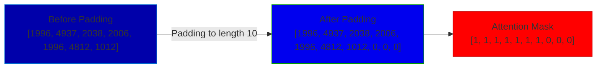
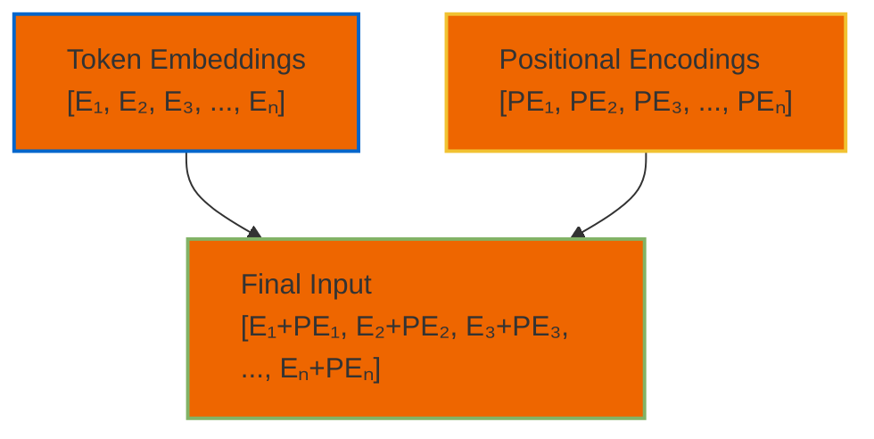
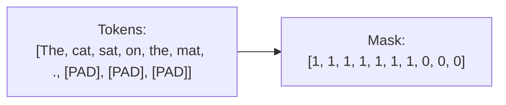
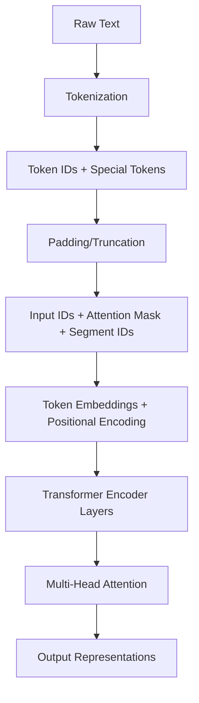

# **Preprocessing Pipeline for Transformer Models with Attention Mechanisms**

## **1. Text Tokenization**

### **Concept**
Convert raw text into numerical tokens that the model can process.

### **Steps**
1. Split text into words/subwords
2. Map tokens to vocabulary indices
3. Handle special tokens ([CLS], [SEP], [PAD])

### **Example**
```python
from transformers import BertTokenizer

tokenizer = BertTokenizer.from_pretrained('bert-base-uncased')

text = "The cat sat on the mat."
tokens = tokenizer.tokenize(text)
token_ids = tokenizer.convert_tokens_to_ids(tokens)

print("Original:", text)
print("Tokens:", tokens)
print("Token IDs:", token_ids)
```

**Output**:
```
Original: The cat sat on the mat.
Tokens: ['the', 'cat', 'sat', 'on', 'the', 'mat', '.']
Token IDs: [1996, 4937, 2038, 2006, 1996, 4812, 1012]
```

---

## **2. Sequence Padding/Truncation**

### **Concept**
Ensure all sequences have uniform length for batch processing.

### **Steps**
1. Pad shorter sequences with [PAD] tokens
2. Truncate longer sequences to max length

### **Example**
```python
max_length = 10
padded_ids = token_ids + [tokenizer.pad_token_id] * (max_length - len(token_ids))
attention_mask = [1] * len(token_ids) + [0] * (max_length - len(token_ids))

print("Padded IDs:", padded_ids)
print("Attention Mask:", attention_mask)
```

**Output**:
```
Padded IDs: [1996, 4937, 2038, 2006, 1996, 4812, 1012, 0, 0, 0]
Attention Mask: [1, 1, 1, 1, 1, 1, 1, 0, 0, 0]
```

### **Visualization**


---

## **3. Positional Encoding**

### **Concept**
Add information about token positions since Transformers don't have inherent sequence awareness.

### **Formula**
```
PE(pos,2i) = sin(pos/10000^(2i/d_model))
PE(pos,2i+1) = cos(pos/10000^(2i/d_model))
```

### **PyTorch Implementation**
```python
import torch
import math

def positional_encoding(max_len, d_model):
    position = torch.arange(max_len).unsqueeze(1)
    div_term = torch.exp(torch.arange(0, d_model, 2) * (-math.log(10000.0) / d_model)
    pe = torch.zeros(max_len, d_model)
    pe[:, 0::2] = torch.sin(position * div_term)
    pe[:, 1::2] = torch.cos(position * div_term)
    return pe

d_model = 512
pe = positional_encoding(max_length, d_model)
print("Positional Encoding Shape:", pe.shape)
```
**Example:**
```
Token Embeddings: [E1, E2, E3, ..., En]
Positional Encodings: [PE1, PE2, PE3, ..., PEn]
Final Input: [E1+PE1, E2+PE2, E3+PE3, ..., En+PEn]
```
### **Visualization**


---

## **4. Attention Mask Creation**

### **Concept**
Tell the model which tokens to attend to (1=real token, 0=padding).

### **Example**
```python
import torch

attention_mask = torch.tensor([attention_mask])  # From Step 2
print("Attention Mask Tensor:")
print(attention_mask)
```

**Output**:
```
tensor([[1, 1, 1, 1, 1, 1, 1, 0, 0, 0]])
```

### **Visualization**


---

## **5. Segment Embeddings (for BERT-style models)**

### **Concept**
Distinguish between multiple sequences (e.g., question/answer pairs).

### **Example**
```python
segment_ids = [0] * max_length  # Single sequence
segment_ids = torch.tensor([segment_ids])
print("Segment IDs:", segment_ids)
```

**Output**:
```
tensor([[0, 0, 0, 0, 0, 0, 0, 0, 0, 0]])
```

---

## **6. Final Input Preparation**

Combine all components into model-ready tensors:

```python
inputs = {
    'input_ids': torch.tensor([padded_ids]),
    'attention_mask': attention_mask,
    'token_type_ids': segment_ids
}
```

---

## **7. Complete Pipeline with PyTorch**

```python
from transformers import BertTokenizer
import torch

tokenizer = BertTokenizer.from_pretrained('bert-base-uncased')

def preprocess(text, max_length=10):
    # Tokenization
    encoding = tokenizer(
        text,
        max_length=max_length,
        padding='max_length',
        truncation=True,
        return_tensors='pt'
    )
    
    # Add positional encoding (usually handled internally)
    return {
        'input_ids': encoding['input_ids'],
        'attention_mask': encoding['attention_mask'],
        'token_type_ids': encoding['token_type_ids']
    }

# Example usage
inputs = preprocess("The cat sat on the mat.")
print("Processed Inputs:")
print(inputs)
```

---

## **8. Attention Mechanism Implementation**

### **Scaled Dot-Product Attention**
```python
def scaled_dot_product_attention(Q, K, V, mask=None):
    d_k = Q.size(-1)
    scores = torch.matmul(Q, K.transpose(-2, -1)) / torch.sqrt(torch.tensor(d_k))
    
    if mask is not None:
        scores = scores.masked_fill(mask == 0, -1e9)
    
    attention = torch.softmax(scores, dim=-1)
    output = torch.matmul(attention, V)
    return output

# Example usage
d_model = 512
seq_len = 10
Q = torch.randn(1, 8, seq_len, d_model//8)  # (batch, heads, seq_len, head_dim)
K = torch.randn(1, 8, seq_len, d_model//8)
V = torch.randn(1, 8, seq_len, d_model//8)

attention_output = scaled_dot_product_attention(Q, K, V)
print("Attention Output Shape:", attention_output.shape)
```

---

## **9. Complete Transformer Block**

```python
class TransformerBlock(nn.Module):
    def __init__(self, d_model, n_heads):
        super().__init__()
        self.attention = nn.MultiheadAttention(d_model, n_heads)
        self.norm1 = nn.LayerNorm(d_model)
        self.ff = nn.Sequential(
            nn.Linear(d_model, 4*d_model),
            nn.ReLU(),
            nn.Linear(4*d_model, d_model)
        self.norm2 = nn.LayerNorm(d_model)
        
    def forward(self, x, mask):
        attn_output, _ = self.attention(x, x, x, key_padding_mask=mask)
        x = self.norm1(x + attn_output)
        ff_output = self.ff(x)
        return self.norm2(x + ff_output)
```

---

## **Visual Summary of Full Pipeline**


This complete pipeline shows how text gets transformed into the numerical representations that Transformer models use to compute attention and make predictions.