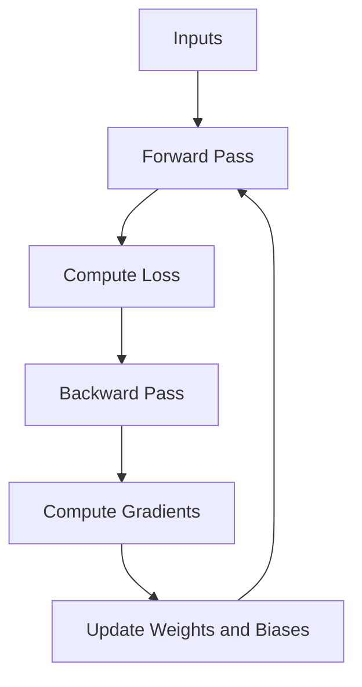

### Backpropagation in Neural Networks: Detailed Explanation

**Backpropagation** (short for "backward propagation of errors") is the algorithm used to train neural networks. It adjusts the weights and biases in the network to minimize the error (loss) between predicted and actual outputs. This process is based on **gradient descent**, which optimizes the network by finding the minimum of the loss function.

---

### **Steps of Backpropagation**

1. **Forward Pass**: Calculate the predicted output by passing inputs through the network layers.
2. **Compute Loss**: Calculate the error (loss) between the predicted output and the actual output using a loss function (e.g., Mean Squared Error, Cross-Entropy).
3. **Backward Pass**:
   - Calculate the gradient of the loss with respect to the output (using the chain rule of calculus).
   - Propagate the gradient backward through the network to calculate the gradients for weights and biases.
4. **Update Weights and Biases**: Adjust the weights and biases using the gradients and a learning rate.

---

### **Mathematics of Backpropagation**

#### **1. Forward Pass**

For a neuron \( j \) in layer \( l \):

- Weighted sum of inputs:

	\[
	z_j^{(l)} = \sum_i w_{ji}^{(l)} a_i^{(l-1)} + b_j^{(l)}
	\]

where:

- \( w_{ji}^{(l)} \): Weight connecting neuron \( i \) in layer \( l-1 \) to neuron \( j \) in layer \( l \).
- \( a_i^{(l-1)} \): Activation from the previous layer.
- \( b_j^{(l)} \): Bias term.

- Activation:

	\[
	a_j^{(l)} = \sigma(z_j^{(l)})
	\]

	where \( \sigma \) is the activation function.

#### **2. Loss Function**

The loss function measures the error. For example, Mean Squared Error:
\[
L = \frac{1}{2} \sum (y - \hat{y})^2
\]
where:
- \( y \): Actual output.
- \( \hat{y} \): Predicted output.

#### **3. Backward Pass**

Using the chain rule, the gradient of the loss \( L \) with respect to a weight \( w \) is computed:

- Error at output layer:
  \[
  \delta_j^{(L)} = \frac{\partial L}{\partial a_j^{(L)}} \cdot \sigma'(z_j^{(L)})
  \]
  where \( \sigma'(z_j^{(L)}) \) is the derivative of the activation function.

- Error at hidden layer:
  \[
  \delta_j^{(l)} = \left( \sum_k w_{kj}^{(l+1)} \delta_k^{(l+1)} \right) \cdot \sigma'(z_j^{(l)})
  \]

- Gradients for weights and biases:
  \[
  \frac{\partial L}{\partial w_{ji}^{(l)}} = \delta_j^{(l)} a_i^{(l-1)}
  \]
  \[
  \frac{\partial L}{\partial b_j^{(l)}} = \delta_j^{(l)}
  \]

#### **4. Weight Update Rule**

Weights and biases are updated using gradient descent:
\[
w_{ji}^{(l)} \gets w_{ji}^{(l)} - \eta \frac{\partial L}{\partial w_{ji}^{(l)}}
\]
\[
b_j^{(l)} \gets b_j^{(l)} - \eta \frac{\partial L}{\partial b_j^{(l)}}
\]
where \( \eta \) is the learning rate.

---

### **Code Example: Backpropagation in Python**

Here’s a simple implementation of backpropagation for a neural network with one hidden layer:

```python
import numpy as np

# Sigmoid activation function and its derivative
def sigmoid(x):
    return 1 / (1 + np.exp(-x))

def sigmoid_derivative(x):
    return x * (1 - x)

# Input data (XOR problem)
inputs = np.array([[0, 0], [0, 1], [1, 0], [1, 1]])
outputs = np.array([[0], [1], [1], [0]])

# Initialize weights and biases
np.random.seed(42)
weights_input_hidden = np.random.rand(2, 2)  # 2 input -> 2 hidden
weights_hidden_output = np.random.rand(2, 1)  # 2 hidden -> 1 output
bias_hidden = np.random.rand(1, 2)
bias_output = np.random.rand(1, 1)

# Learning rate
learning_rate = 0.1
epochs = 10000

# Training loop
for epoch in range(epochs):
    # Forward pass
    hidden_layer_input = np.dot(inputs, weights_input_hidden) + bias_hidden
    hidden_layer_output = sigmoid(hidden_layer_input)

    output_layer_input = np.dot(hidden_layer_output, weights_hidden_output) + bias_output
    predicted_output = sigmoid(output_layer_input)

    # Backward pass
    error = outputs - predicted_output
    d_predicted_output = error * sigmoid_derivative(predicted_output)

    error_hidden_layer = d_predicted_output.dot(weights_hidden_output.T)
    d_hidden_layer = error_hidden_layer * sigmoid_derivative(hidden_layer_output)

    # Update weights and biases
    weights_hidden_output += hidden_layer_output.T.dot(d_predicted_output) * learning_rate
    weights_input_hidden += inputs.T.dot(d_hidden_layer) * learning_rate
    bias_output += np.sum(d_predicted_output, axis=0, keepdims=True) * learning_rate
    bias_hidden += np.sum(d_hidden_layer, axis=0, keepdims=True) * learning_rate

# Results
print("Final Predicted Output:")
print(predicted_output)
```

---

### **Diagram: Backpropagation Workflow**



---

### **Key Points**

1. **Gradient Descent**: Backpropagation relies on gradient descent to minimize the loss function.
2. **Chain Rule**: Gradients are computed using the chain rule of calculus.
3. **Iterative Process**: Weights and biases are updated iteratively until the loss converges.

Backpropagation is the backbone of neural network training, enabling models to learn from data and improve performance over time.