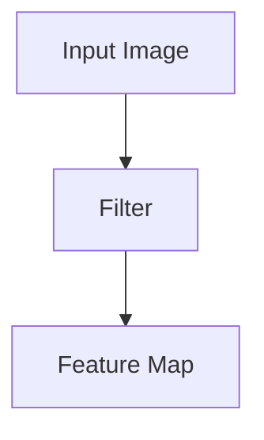

# Convolutional Neural Networks (CNN) - A Detailed Explanation

Convolutional Neural Networks (CNNs) are a class of deep learning models specifically designed for tasks involving spatial data, such as images. They are widely used in image recognition, object detection, and other computer vision tasks.

---

## What is a CNN?

A CNN is a type of neural network that leverages the spatial structure of data. It uses convolutional layers to extract features from input images, pooling layers to reduce dimensions, and fully connected layers to perform classification or regression.


---

## Components of a CNN

### 1. **Convolutional Layer**
This layer applies a set of filters (kernels) to the input image to extract features like edges, textures, or patterns.

#### Formula:
The convolution operation can be expressed as:

\[ (f * g)(t) = \int f(a)g(t - a)da \]

In discrete form:

\[ y[i] = \sum_{j} x[j] \cdot w[i-j] \]

#### Code Example:
```python
import torch
import torch.nn as nn

# Example Convolution Layer
conv_layer = nn.Conv2d(in_channels=1, out_channels=3, kernel_size=3, stride=1, padding=1)
input_image = torch.rand(1, 1, 28, 28)  # Batch size, Channels, Height, Width
output = conv_layer(input_image)
print(output.shape)  # Output shape: (1, 3, 28, 28)
```

#### Diagram:




---

### 2. **Pooling Layer**
This layer reduces the spatial dimensions of the feature maps, retaining important features while discarding redundant information.

#### Types:
- Max Pooling
- Average Pooling

#### Code Example:
```python
# Example Pooling Layer
pool_layer = nn.MaxPool2d(kernel_size=2, stride=2)
pooled_output = pool_layer(output)
print(pooled_output.shape)  # Output shape: (1, 3, 14, 14)
```

#### Diagram:

```plaintext
Feature Map ---> [Pooling] ---> Reduced Feature Map
```
**Max Pooling**


**Average Pooling**


---

### 3. **Fully Connected Layer**
This layer connects the extracted features to the final output for classification or regression tasks.

#### Code Example:
```python
# Fully Connected Layer
fc_layer = nn.Linear(3 * 14 * 14, 10)  # Example: Flatten input and map to 10 classes
flattened_output = pooled_output.view(1, -1)
final_output = fc_layer(flattened_output)
print(final_output.shape)  # Output shape: (1, 10)
```

#### Diagram:
```plaintext
Flattened Features ---> Fully Connected Layer ---> Output
```


---

## Building a CNN with PyTorch

Below is an example of building a simple CNN for digit classification (MNIST dataset).

### Full Code Example:
```python
import torch
import torch.nn as nn
import torch.optim as optim
from torchvision import datasets, transforms
from torch.utils.data import DataLoader

# Define CNN Model
class SimpleCNN(nn.Module):
    def __init__(self):
        super(SimpleCNN, self).__init__()
        self.conv1 = nn.Conv2d(1, 16, kernel_size=3, stride=1, padding=1)
        self.pool = nn.MaxPool2d(kernel_size=2, stride=2)
        self.conv2 = nn.Conv2d(16, 32, kernel_size=3, stride=1, padding=1)
        self.fc1 = nn.Linear(32 * 7 * 7, 128)
        self.fc2 = nn.Linear(128, 10)

    def forward(self, x):
        x = self.pool(torch.relu(self.conv1(x)))
        x = self.pool(torch.relu(self.conv2(x)))
        x = x.view(-1, 32 * 7 * 7)  # Flatten
        x = torch.relu(self.fc1(x))
        x = self.fc2(x)
        return x

# Load Data
transform = transforms.Compose([transforms.ToTensor(), transforms.Normalize((0.5,), (0.5,))])
train_dataset = datasets.MNIST(root='./data', train=True, download=True, transform=transform)
train_loader = DataLoader(train_dataset, batch_size=64, shuffle=True)

# Initialize Model, Loss, and Optimizer
model = SimpleCNN()
criterion = nn.CrossEntropyLoss()
optimizer = optim.Adam(model.parameters(), lr=0.001)

# Training Loop
for epoch in range(5):
    for images, labels in train_loader:
        optimizer.zero_grad()
        outputs = model(images)
        loss = criterion(outputs, labels)
        loss.backward()
        optimizer.step()
    print(f"Epoch {epoch+1}, Loss: {loss.item():.4f}")

print("Training Complete!")
```

---

## Visualizing Filters and Feature Maps

### Visualizing Filters
The filters in the first layer of a CNN can be visualized to understand what features the network is learning.

#### Code Example:
```python
filters = model.conv1.weight.data
print(filters.shape)  # Shape: (16, 1, 3, 3)
```


### Visualizing Feature Maps
Feature maps represent the activation outputs of convolutional layers.

#### Code Example:
```python
feature_maps = model.conv1(input_image)
print(feature_maps.shape)  # Shape: (1, 16, 28, 28)
```


---

## Summary

A CNN combines:

- **Convolutional Layers** to extract spatial features.
- **Pooling Layers** to reduce dimensionality.
- **Fully Connected Layers** to perform classification or regression.

This step-by-step guide covered:

1. Theoretical foundations.
2. Code examples using PyTorch.
3. Visualization of filters and feature maps.

Explore CNNs and unlock the potential of deep learning in computer vision!

---

