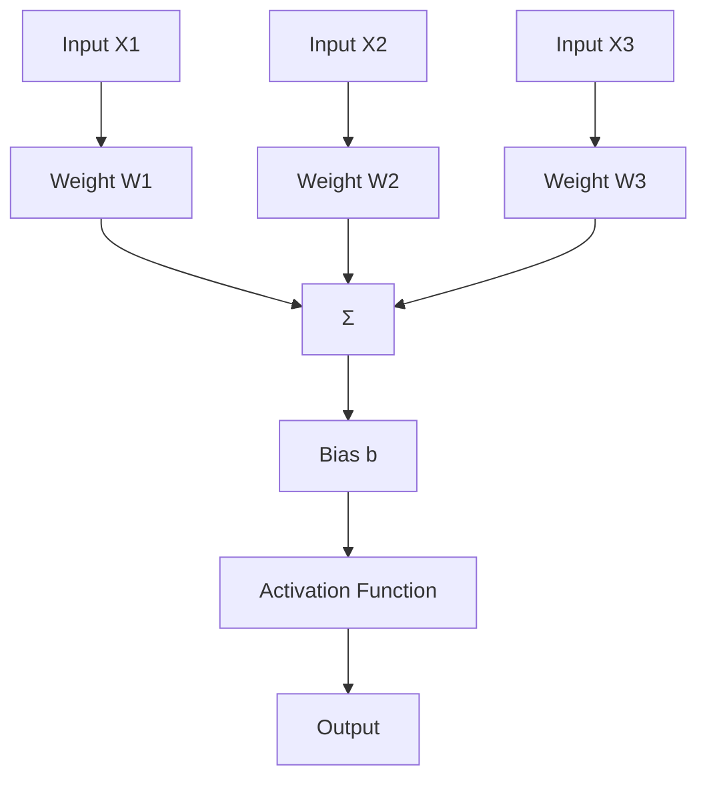
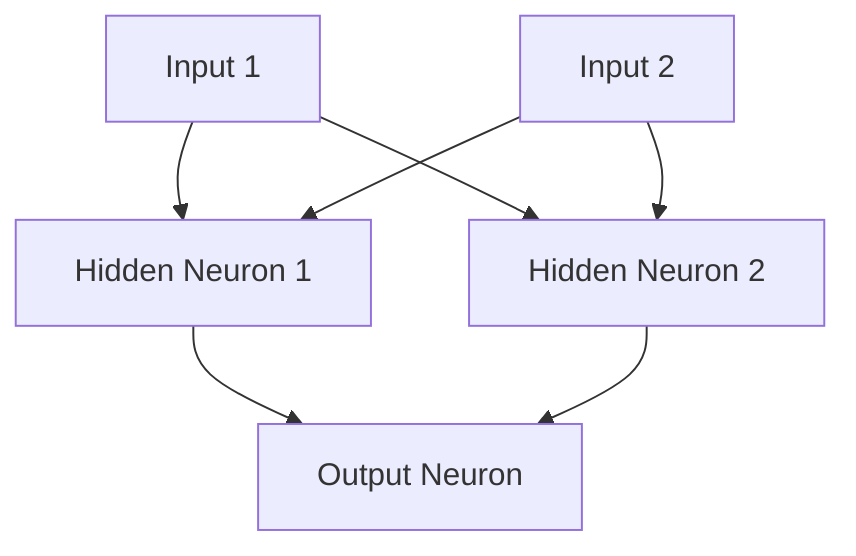

## Neural Networks: A Detailed Explanation

A **neural network** is a computational model inspired by the human brain. It consists of interconnected layers of nodes (neurons) designed to process input data and generate predictions or classifications. Neural networks are at the core of deep learning, enabling machines to perform tasks like image recognition, natural language processing, and more.

---

### **Components of a Neural Network**

1. **Neurons**: The basic units of computation in a neural network. Each neuron receives inputs, applies a weight and bias, and produces an output through an activation function.

2. **Layers**:
    - **Input Layer**: Accepts input data (e.g., features like pixels in an image).
    - **Hidden Layers**: Perform computations and extract patterns from the input data.
    - **Output Layer**: Produces the final result (e.g., classification or regression).

3. **Weights and Biases**: Parameters that are adjusted during training to optimize the network's performance.

4. **Activation Function**: Adds non-linearity to the network, enabling it to learn complex patterns.
    Common activation functions: Sigmoid, ReLU, Tanh.

5. **Loss Function**: Measures the difference between predicted and actual values, guiding the network's learning process.

6. **Optimizer**: Updates weights and biases to minimize the loss function (e.g., Stochastic Gradient Descent, Adam).

---

### **How a Single Neuron Works**

A single neuron performs the following operations:

1. **Weighted Sum**:
   Each input is multiplied by its respective weight, and the results are summed. A bias term is added:
   
	\[
	z = \sum_{i=1}^{n} w_i x_i + b
	\]

2. **Activation**:
   The weighted sum is passed through an activation function to produce the output:
   
	\[
	a = \sigma(z)
	\]

---

### **Example: Single Neuron Implementation**

```python
import numpy as np

# Input data (features)
inputs = np.array([1.0, 2.0, 3.0])

# Weights and bias
weights = np.array([0.5, -0.6, 0.8])
bias = 0.1

# Activation function (ReLU in this case)
def relu(x):
    return max(0, x)

# Compute the weighted sum
z = np.dot(inputs, weights) + bias

# Apply activation function
output = relu(z)

print(f"Weighted Sum (z): {z}")
print(f"Neuron Output: {output}")
```

---

### **Diagram of a Single Neuron**



---

### **Building a Simple Neural Network**

Here is an example of a basic feedforward neural network with one hidden layer using Python and NumPy:

#### **Example Code**
```python
import numpy as np

# Sigmoid activation function
def sigmoid(x):
    return 1 / (1 + np.exp(-x))

# Derivative of the sigmoid function
def sigmoid_derivative(x):
    return x * (1 - x)

# Input data (2 samples, 2 features)
inputs = np.array([[0, 0], [0, 1], [1, 0], [1, 1]])

# Expected outputs (XOR problem)
outputs = np.array([[0], [1], [1], [0]])

# Initialize weights and biases
np.random.seed(42)
weights_input_hidden = np.random.uniform(-1, 1, (2, 2))
weights_hidden_output = np.random.uniform(-1, 1, (2, 1))
bias_hidden = np.random.uniform(-1, 1, (1, 2))
bias_output = np.random.uniform(-1, 1, (1, 1))

# Training parameters
learning_rate = 0.1
epochs = 10000

# Training loop
for epoch in range(epochs):
    # Forward pass
    hidden_layer_input = np.dot(inputs, weights_input_hidden) + bias_hidden
    hidden_layer_output = sigmoid(hidden_layer_input)

    final_layer_input = np.dot(hidden_layer_output, weights_hidden_output) + bias_output
    final_output = sigmoid(final_layer_input)

    # Backpropagation
    error = outputs - final_output
    d_output = error * sigmoid_derivative(final_output)

    error_hidden_layer = d_output.dot(weights_hidden_output.T)
    d_hidden_layer = error_hidden_layer * sigmoid_derivative(hidden_layer_output)

    # Update weights and biases
    weights_hidden_output += hidden_layer_output.T.dot(d_output) * learning_rate
    weights_input_hidden += inputs.T.dot(d_hidden_layer) * learning_rate
    bias_output += np.sum(d_output, axis=0, keepdims=True) * learning_rate
    bias_hidden += np.sum(d_hidden_layer, axis=0, keepdims=True) * learning_rate

# Testing
print("Final Output:")
print(final_output)
```

---

### **Diagram of a Simple Neural Network**



---

### **Key Points**

- **Forward Pass**: Inputs are propagated through the network to produce outputs.
- **Backward Pass**: Errors are backpropagated to update weights and biases using the gradient descent algorithm.
- **Training**: Involves iteratively optimizing weights and biases to minimize the error.

---

### **Applications**

- Image classification
- Speech recognition
- Language translation
- Autonomous vehicles
- Predictive analytics

Neural networks are fundamental to modern AI, enabling machines to solve complex, non-linear problems effectively.