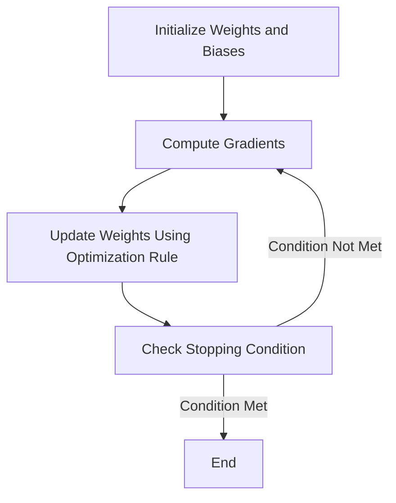

### Optimization Algorithms in Neural Networks: Detailed Overview

Optimization algorithms play a crucial role in training neural networks by minimizing the **loss function**, which quantifies the error between the predicted and actual outputs. The goal of these algorithms is to adjust the model’s parameters (weights and biases) to achieve the best possible performance.

---

### **Gradient-Based Optimization Algorithms**

These algorithms rely on **gradients** to optimize the loss function. Gradients are computed using backpropagation.

---

#### 1. **Gradient Descent (GD)**

- **Description**: Updates the weights by calculating the gradient of the loss function for the entire training dataset.
- **Update Rule**:

\[
w \gets w - \eta \frac{\partial L}{\partial w}
\]

  where:

  - \( \eta \): Learning rate.
  - \( \frac{\partial L}{\partial w} \): Gradient of the loss \( L \) with respect to \( w \).

<br>

**Advantages**:

  - Simple and effective for convex functions.

**Disadvantages**:

  - Computationally expensive for large datasets.
  - Requires the entire dataset for each update.

---

#### 2. **Stochastic Gradient Descent (SGD)**

- **Description**: Updates the weights using a single randomly selected training example at each step.
- **Update Rule**:

    \[
    w \gets w - \eta \frac{\partial L_i}{\partial w}
    \]

  where \( L_i \) is the loss for a single data point.

**Advantages**:

  - Faster updates.
  - Can escape local minima due to randomness.

**Disadvantages**:

  - High variance in updates, leading to noisy convergence.

---

#### 3. **Mini-Batch Gradient Descent**

- **Description**: Combines the advantages of GD and SGD by using small batches of data for each update.
- **Update Rule**:

\[
w \gets w - \eta \frac{1}{m} \sum_{i=1}^{m} \frac{\partial L_i}{\partial w}
\]

  where \( m \) is the batch size.

**Advantages**:
    - Faster convergence than GD.
    - Reduces noise compared to SGD.

**Disadvantages**:
    - Requires tuning the batch size.

---

#### 4. **Momentum**

- **Description**: Adds a fraction of the previous update to the current update to accelerate convergence.
- **Update Rule**:

\[
v_t = \gamma v_{t-1} + \eta \frac{\partial L}{\partial w}
\]

\[
w \gets w - v_t
\]

  where \( \gamma \) is the momentum factor (e.g., 0.9).

**Advantages**:

  - Speeds up convergence in directions with consistent gradients.
  - Reduces oscillations.

---

#### 5. **Nesterov Accelerated Gradient (NAG)**

- **Description**: A variation of Momentum that computes the gradient at the approximate future position of the parameters.
- **Update Rule**:

\[
v_t = \gamma v_{t-1} + \eta \frac{\partial L}{\partial w_t - \gamma v_{t-1}}
\]

\[
w \gets w - v_t
\]

**Advantages**:
  - Faster convergence than Momentum.

---

#### 6. **Adagrad**

- **Description**: Adapts the learning rate for each parameter based on the sum of squared gradients.
- **Update Rule**:

\[
w \gets w - \frac{\eta}{\sqrt{G_t + \epsilon}} \frac{\partial L}{\partial w}
\]

  where \( G_t \) is the sum of squared gradients and \( \epsilon \) is a small constant.

**Advantages**:
  - Works well for sparse data.

**Disadvantages**:
  - Learning rate may become too small over time.

---

#### 7. **RMSProp**

- **Description**: Modifies Adagrad by using an exponentially decaying average of squared gradients.
- **Update Rule**:

\[
G_t = \beta G_{t-1} + (1 - \beta) \frac{\partial L}{\partial w}^2
\]

\[
w \gets w - \frac{\eta}{\sqrt{G_t + \epsilon}} \frac{\partial L}{\partial w}
\]

  where \( \beta \) is the decay rate.

**Advantages**:

  - Suitable for non-stationary objectives.
  - Prevents learning rates from becoming too small.

---

#### 8. **Adam (Adaptive Moment Estimation)**

- **Description**: Combines Momentum and RMSProp by maintaining both moving averages of gradients and their squared values.
- **Update Rule**:

\[
m_t = \beta_1 m_{t-1} + (1 - \beta_1) \frac{\partial L}{\partial w}
\]

\[
v_t = \beta_2 v_{t-1} + (1 - \beta_2) \left( \frac{\partial L}{\partial w} \right)^2
\]

\[
w \gets w - \frac{\eta}{\sqrt{\hat{v}_t} + \epsilon} \hat{m}_t
\]

  where:
  - \( \hat{m}_t \) and \( \hat{v}_t \) are bias-corrected estimates of \( m_t \) and \( v_t \).

**Advantages**:

  - Works well for most problems.
  - Combines benefits of Momentum and RMSProp.

---

### **Comparison of Optimization Algorithms**

| Algorithm     | Learning Rate | Memory Requirement | Convergence Speed | Suitable for Large Data |
|---------------|---------------|---------------------|-------------------|-------------------------|
| Gradient Descent | Fixed        | Low                 | Slow              | No                      |
| SGD           | Fixed        | Low                 | Fast              | Yes                     |
| Momentum      | Fixed        | Low                 | Faster            | Yes                     |
| NAG           | Fixed        | Low                 | Faster            | Yes                     |
| Adagrad       | Adaptive     | Moderate            | Moderate          | Yes                     |
| RMSProp       | Adaptive     | Moderate            | Moderate          | Yes                     |
| Adam          | Adaptive     | High                | Fast              | Yes                     |

---

### **Code Example: Using Adam Optimizer in PyTorch**

Here’s an example of implementing an optimizer in PyTorch:

```python
import torch
import torch.nn as nn
import torch.optim as optim

# Define a simple model
model = nn.Linear(2, 1)

# Define loss function
criterion = nn.MSELoss()

# Define optimizer (Adam)
optimizer = optim.Adam(model.parameters(), lr=0.01)

# Dummy data
inputs = torch.tensor([[1.0, 2.0], [3.0, 4.0], [5.0, 6.0]])
targets = torch.tensor([[3.0], [7.0], [11.0]])

# Training loop
for epoch in range(100):
    optimizer.zero_grad()  # Clear gradients
    outputs = model(inputs)  # Forward pass
    loss = criterion(outputs, targets)  # Compute loss
    loss.backward()  # Backpropagation
    optimizer.step()  # Update parameters

    if epoch % 10 == 0:
        print(f'Epoch {epoch}, Loss: {loss.item()}')
```

---

### **Diagram: Optimization Workflow**



---

### **Conclusion**

Optimization algorithms are the backbone of neural network training. Choosing the right algorithm depends on the problem, data size, and desired computational efficiency. Among all, **Adam** is the most widely used due to its adaptive nature and robustness.