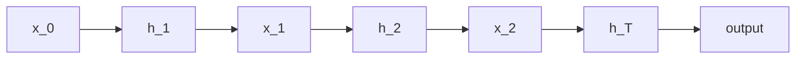

# Understanding Recurrent Neural Networks (RNN)
### Detailed Architecture of Recurrent Neural Networks (RNN)

Recurrent Neural Networks (RNNs) are a class of artificial neural networks designed to model sequential data. Unlike feedforward neural networks, RNNs have connections that form directed cycles, allowing them to maintain a **hidden state** and remember previous inputs in the sequence. This characteristic makes RNNs well-suited for tasks involving sequences, such as time series prediction, natural language processing, and speech recognition.

---

## Core Components of RNN

### 1. Input
Each time step of the sequence provides an input vector \( x_t \) to the RNN. For instance, in a sentence, each word could be represented as a vector (e.g., word embeddings).

- **Input at Time \( t \)**: \( x_t \)
- Example: For a sequence of words ["I", "love", "RNN"], \( x_t \) could represent the embedding of each word.

### 2. Hidden State
The hidden state \( h_t \) serves as the memory of the network. It captures information about the sequence seen so far. At each time step, the hidden state is updated based on the current input \( x_t \) and the previous hidden state \( h_{t-1} \).

- **Equation**:

\[
h_t = f(W_{xh}x_t + W_{hh}h_{t-1} + b_h)
\]

  Where:

  - \( W_{xh} \): Weight matrix for the input
  - \( W_{hh} \): Weight matrix for the hidden state
  - \( b_h \): Bias vector
  - \( f \): Activation function (e.g., tanh)

### 3. Output
The output \( y_t \) at each time step depends on the current hidden state \( h_t \).

- **Equation**:

  	\[
  	y_t = g(W_{hy}h_t + b_y)
  	\]

  Where:

  - \( W_{hy} \): Weight matrix for the output
  - \( b_y \): Bias vector
  - \( g \): Activation function (e.g., softmax for classification)

### 4. Recurrent Loop
The key feature of an RNN is its recurrent loop, where the hidden state from the previous time step \( h_{t-1} \) is fed back into the network at the current time step \( t \). This recurrence allows the RNN to maintain a temporal context.

---

## RNN Architecture Diagram

Below is a step-by-step breakdown of how RNN processes sequences:

1. At time \( t = 0 \):
   - Input \( x_0 \) is fed into the network.
   - Initial hidden state \( h_0 \) is typically initialized to zeros.
   - The hidden state \( h_1 \) is computed and used in the next step.

2. At time \( t = 1 \):
   - Input \( x_1 \) and \( h_1 \) are used to compute \( h_2 \).
   - The process repeats for all time steps.

3. At the final time step \( T \):
   - Output \( y_T \) is produced based on the last hidden state \( h_T \).

### Unrolled RNN

To visualize the recurrent nature, an RNN can be "unrolled" across time steps. For a sequence of \( T \) steps:



---

## Step-by-Step Computational Flow

### 1. Input Embedding
The input \( x_t \) (e.g., a word in a sentence) is converted into a numerical vector using techniques like one-hot encoding or word embeddings.

### 2. Hidden State Update
The hidden state \( h_t \) is computed using:

\[
h_t = \tanh(W_{xh}x_t + W_{hh}h_{t-1} + b_h)
\]

- Activation Function: Typically `tanh` or `ReLU`.

### 3. Output Generation
The output \( y_t \) at each time step is calculated using:

\[
y_t = \text{softmax}(W_{hy}h_t + b_y)
\]

- For classification tasks, softmax normalizes the outputs into probabilities.

---

## Challenges in RNNs

### 1. Vanishing and Exploding Gradients
- RNNs struggle with long sequences due to vanishing or exploding gradients during backpropagation.
- **Solution**: Use architectures like LSTMs or GRUs.

### 2. Limited Memory
- The hidden state of RNNs retains only a limited amount of information from the past.
- **Solution**: LSTMs/GRUs provide a gating mechanism to control memory flow.

---

## Variants of RNN

### 1. Bidirectional RNN (BiRNN)
- Processes input sequences in both forward and backward directions.
- Useful for tasks like text translation and speech recognition.

### 2. Long Short-Term Memory (LSTM)
- Enhances RNNs with memory cells and gating mechanisms.
- Gates: Input gate, Forget gate, Output gate.

### 3. Gated Recurrent Unit (GRU)
- A simplified version of LSTM with fewer parameters.

---

## Applications of RNNs

1. **Time Series Forecasting**:
   Predicting stock prices, weather patterns, or energy consumption.
   
2. **Natural Language Processing (NLP)**:
   - Sentiment analysis
   - Machine translation
   - Text generation

3. **Speech and Audio Processing**:
   Converting speech to text or generating audio.

4. **Video Analysis**:
   Action recognition and caption generation.

---

## Code Example: Simple RNN Implementation

```python
import torch
import torch.nn as nn

# Define RNN Model
class RNNModel(nn.Module):
    def __init__(self, input_size, hidden_size, output_size):
        super(RNNModel, self).__init__()
        self.rnn = nn.RNN(input_size, hidden_size, batch_first=True)
        self.fc = nn.Linear(hidden_size, output_size)

    def forward(self, x):
        h0 = torch.zeros(1, x.size(0), hidden_size)  # Initialize hidden state
        out, _ = self.rnn(x, h0)  # RNN output
        out = self.fc(out[:, -1, :])  # Fully connected layer for output
        return out

# Parameters
input_size = 1
hidden_size = 10
output_size = 1
sequence_length = 5
batch_size = 3

# Dummy Data
x = torch.randn(batch_size, sequence_length, input_size)
y = torch.randn(batch_size, output_size)

# Initialize Model
model = RNNModel(input_size, hidden_size, output_size)
criterion = nn.MSELoss()
optimizer = torch.optim.Adam(model.parameters(), lr=0.01)

# Training Loop
for epoch in range(100):
    optimizer.zero_grad()
    output = model(x)
    loss = criterion(output, y)
    loss.backward()
    optimizer.step()

    if epoch % 10 == 0:
        print(f"Epoch {epoch}, Loss: {loss.item():.4f}")
```

---

## Key Takeaways

- **RNNs**: Handle sequential data by maintaining a hidden state across time steps.
- **Challenges**: Vanishing gradients and limited memory for long sequences.
- **Solutions**: LSTMs and GRUs are advanced RNN architectures that address these challenges.
- **Applications**: Time series prediction, text processing, speech recognition.

Mastering RNNs is essential for working with sequential data. Their variants, like LSTMs and GRUs, expand their capabilities and applications.
---

## Key Concepts of RNNs

### Sequential Data
RNNs excel in handling sequential data where the order of data points matters. Examples include:
- **Time Series Data**: Stock prices, weather data
- **Natural Language Processing (NLP)**: Sentiment analysis, machine translation
- **Speech Recognition**: Audio-to-text conversion

### Advanced RNN Architectures: LSTM and GRU

To address the limitations of vanilla RNNs, such as the **vanishing gradient problem** and the inability to model long-term dependencies effectively, advanced RNN architectures like **Long Short-Term Memory (LSTM)** and **Gated Recurrent Unit (GRU)** were developed. These architectures use gating mechanisms to control the flow of information, enabling them to remember or forget information over long sequences.

---

## **1. Long Short-Term Memory (LSTM)**

LSTMs were introduced by Hochreiter and Schmidhuber in 1997 to address the vanishing gradient problem. They have a more complex architecture than vanilla RNNs, incorporating multiple gates to manage information flow.

### **Key Components of LSTM**

1. **Cell State (\( C_t \))**:
   - Acts as a memory track, carrying information across time steps.
   - Information is added or removed from this memory through carefully regulated gates.

2. **Gates**:
   - LSTMs have three key gates that control the information flow:
     - **Forget Gate** (\( f_t \))
     - **Input Gate** (\( i_t \))
     - **Output Gate** (\( o_t \))

### **LSTM Workflow**

At each time step \( t \), the LSTM cell performs the following operations:

#### **1. Forget Gate** (\( f_t \)):
   Decides which information to discard from the previous cell state.

\[
f_t = \sigma(W_f \cdot [h_{t-1}, x_t] + b_f)
\]

   - \( W_f \): Weight matrix for the forget gate.
   - \( \sigma \): Sigmoid activation function, ensuring \( f_t \in [0, 1] \).

#### **2. Input Gate** (\( i_t \)) and Candidate Cell State (\( \tilde{C}_t \)): 
Determines which information to update in the cell state.

\[
i_t = \sigma(W_i \cdot [h_{t-1}, x_t] + b_i)
\]

\[
\tilde{C}_t = \tanh(W_C \cdot [h_{t-1}, x_t] + b_C)
\]

#### **3. Update Cell State (\( C_t \))**:
   Combines the old cell state (\( C_{t-1} \)) and the new candidate (\( \tilde{C}_t \)).

\[
C_t = f_t \odot C_{t-1} + i_t \odot \tilde{C}_t
\]

   - \( \odot \): Element-wise multiplication.

#### **4. Output Gate** (\( o_t \)) and Hidden State (\( h_t \)):
   Controls the output information to the next layer or time step.

\[
o_t = \sigma(W_o \cdot [h_{t-1}, x_t] + b_o)
\]

\[
h_t = o_t \odot \tanh(C_t)
\]

---

### **Diagram: LSTM Architecture**
<figure markdown='span'>
	
	<figcaption> Architecture of RNN </figcaption>
</figure>

---

## **2. Gated Recurrent Unit (GRU)**

The GRU, introduced by Cho et al. in 2014, simplifies the LSTM by combining the forget and input gates into a single **update gate**. GRUs have fewer parameters than LSTMs, making them faster to train while maintaining similar performance for many tasks.

### **Key Components of GRU**

1. **Update Gate (\( z_t \))**:
   - Controls the extent to which the hidden state is updated with new information.

\[
z_t = \sigma(W_z \cdot [h_{t-1}, x_t] + b_z)
\]

2. **Reset Gate (\( r_t \))**:
   - Decides how much of the previous hidden state to forget.

\[
r_t = \sigma(W_r \cdot [h_{t-1}, x_t] + b_r)
\]

3. **Candidate Hidden State (\( \tilde{h}_t \))**:
   - Represents the new hidden state based on the reset gate.

\[
\tilde{h}_t = \tanh(W \cdot [r_t \odot h_{t-1}, x_t] + b)
\]

4. **Final Hidden State (\( h_t \))**:
   - Combines the previous hidden state and the candidate hidden state using the update gate.

\[
h_t = z_t \odot h_{t-1} + (1 - z_t) \odot \tilde{h}_t
\]

---

### **Diagram: GRU Architecture**
```mermaid
flowchart TD
    subgraph GRU
        x_t[Input (x_t)] -->|Concat| update_gate[Update Gate (z_t)]
        h_t_1[Prev Hidden (h_{t-1})] -->|Concat| update_gate
        update_gate --> candidate_hidden[Candidate (h_t~)]
        candidate_hidden --> final_hidden[Final Hidden (h_t)]
        x_t -->|Concat| reset_gate[Reset Gate (r_t)]
        reset_gate --> candidate_hidden
    end

```

---

## **Key Differences Between LSTM and GRU**

| Feature                | LSTM                              | GRU                               |
|------------------------|-----------------------------------|-----------------------------------|
| Number of Gates        | 3 (Forget, Input, Output)         | 2 (Update, Reset)                |
| Cell State             | Maintains a separate cell state   | No separate cell state           |
| Complexity             | More parameters                  | Fewer parameters                 |
| Training Speed         | Slower                           | Faster                           |
| Memory Capacity        | Can model longer dependencies    | Slightly less capacity           |

---

## **Code Example: LSTM vs GRU in PyTorch**

```python
import torch
import torch.nn as nn

# LSTM Model
class LSTMModel(nn.Module):
    def __init__(self, input_size, hidden_size, output_size):
        super(LSTMModel, self).__init__()
        self.lstm = nn.LSTM(input_size, hidden_size, batch_first=True)
        self.fc = nn.Linear(hidden_size, output_size)

    def forward(self, x):
        _, (h_n, _) = self.lstm(x)
        out = self.fc(h_n[-1])
        return out

# GRU Model
class GRUModel(nn.Module):
    def __init__(self, input_size, hidden_size, output_size):
        super(GRUModel, self).__init__()
        self.gru = nn.GRU(input_size, hidden_size, batch_first=True)
        self.fc = nn.Linear(hidden_size, output_size)

    def forward(self, x):
        _, h_n = self.gru(x)
        out = self.fc(h_n[-1])
        return out

# Sample Data
input_size = 10
hidden_size = 20
output_size = 1
seq_len = 5
batch_size = 3

x = torch.randn(batch_size, seq_len, input_size)

# Models
lstm_model = LSTMModel(input_size, hidden_size, output_size)
gru_model = GRUModel(input_size, hidden_size, output_size)

# Forward Pass
lstm_output = lstm_model(x)
gru_output = gru_model(x)

print("LSTM Output:", lstm_output)
print("GRU Output:", gru_output)
```

---

## **Applications of LSTM and GRU**

1. **Natural Language Processing (NLP)**:
   - Machine Translation
   - Sentiment Analysis
   - Text Summarization

2. **Time Series Prediction**:
   - Stock Market Forecasting
   - Weather Prediction

3. **Speech Processing**:
   - Speech Recognition
   - Voice Synthesis

4. **Video Processing**:
   - Action Recognition
   - Video Captioning

These advanced RNNs provide powerful tools for sequence modeling by effectively managing long-term dependencies.

---

## Practical Application: Sentiment Analysis

We can use an RNN to classify text (e.g., positive/negative sentiment).

### Code Example
```python
import torchtext
from torchtext.datasets import IMDB
from torchtext.data.utils import get_tokenizer
from torch.nn.utils.rnn import pad_sequence

# Data preprocessing
tokenizer = get_tokenizer("basic_english")
def preprocess(text):
    return torch.tensor([vocab[token] for token in tokenizer(text)], dtype=torch.long)

# Example data pipeline setup
# Assume `vocab` is built, and data is tokenized and padded for batch training.

# Define an RNN for classification
class SentimentRNN(nn.Module):
    def __init__(self, vocab_size, embed_size, hidden_size, output_size):
        super(SentimentRNN, self).__init__()
        self.embedding = nn.Embedding(vocab_size, embed_size)
        self.rnn = nn.RNN(embed_size, hidden_size, batch_first=True)
        self.fc = nn.Linear(hidden_size, output_size)

    def forward(self, x):
        x = self.embedding(x)
        _, h_n = self.rnn(x)
        return self.fc(h_n[-1])

# Define parameters and train as shown in earlier examples.
```

---

## Key Takeaways

1. **RNNs**: Great for sequential data but suffer from vanishing gradients.
2. **LSTMs/GRUs**: Handle long-term dependencies better than traditional RNNs.
3. **Applications**: Time series forecasting, text generation, sentiment analysis.


