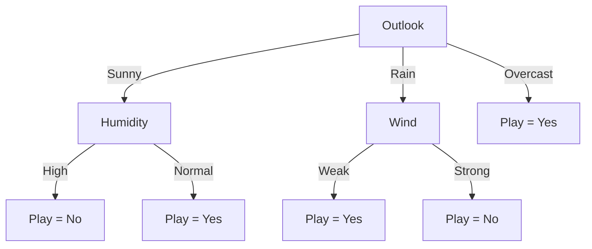

# Decision Tree Representation

A **Decision Tree** is a hierarchical data structure that represents a learned function using a sequence of **if/else decisions**. These decisions are organized in a tree-like structure that leads to a final prediction or classification.

One of the key strengths of decision trees is their **interpretability**. They can easily be transformed into a set of **IF–THEN rules**, making them understandable even for non-technical users.

---

## 1. Structural Components of a Decision Tree

A decision tree is composed of three main types of nodes:

---

## 🌳 Root Node

The **root node** is the topmost node of the tree.

- It represents the **entire dataset**.
- It contains the **first attribute test** used to split the data.
- The goal is to choose the most informative feature at this level.

Mathematically, the dataset \( D \) is initially split as:

$$
D \rightarrow \{D_1, D_2, \dots, D_k\}
$$

based on the best attribute.

---

## 🌿 Internal (Decision / Branch) Nodes

Internal nodes represent **decision points** in the tree.

- Each internal node performs a **test on an attribute**.
- Each outgoing edge represents a **possible outcome** of that test.
- These nodes recursively split the dataset into smaller subsets.

A typical decision rule can be represented as:

$$
\text{if } x_j \leq t \rightarrow \text{go left, otherwise go right}
$$

where:
- \( x_j \) is a feature
- \( t \) is a threshold value

Each path from the root to a leaf corresponds to a **conjunction of conditions**:

$$
\bigwedge_{i=1}^{n} condition_i
$$

---

## 🍃 Leaf (Terminal) Nodes

Leaf nodes represent the **final output** of the decision tree.

### 📌 In Classification

- The leaf contains a **class label** or **probability distribution** over classes.
- Example:

$$
P(y = c \mid x)
$$

---

### 📌 In Regression

- The leaf contains a **continuous numeric value**.
- Typically, it is the **mean of target values** in that region:

$$
\hat{y} = \frac{1}{N} \sum_{i=1}^{N} y_i
$$

---

## 🌲 Full Decision Tree Example

## 🔁 Summary of Tree Flow

A decision tree works by recursively applying tests:

1. Start at the **root node**
2. Evaluate conditions at **internal nodes**
3. Traverse branches based on feature values
4. Reach a **leaf node**
5. Output prediction

---

## 🧠 Key Insight

A decision tree can also be interpreted as a **disjunction of conjunctions**:

$$
f(x) = \bigvee_{i=1}^{k} \left( \bigwedge_{j=1}^{m_i} condition_{ij} \right)
$$

This means:
- Each root-to-leaf path is a **conjunction (AND)** of conditions
- The full tree is a **disjunction (OR)** of all paths

---

## 📌 Why Decision Trees Are Popular

- Easy to interpret and explain
- Works with both numerical and categorical data
- No need for feature scaling
- Can be converted into IF–THEN rules