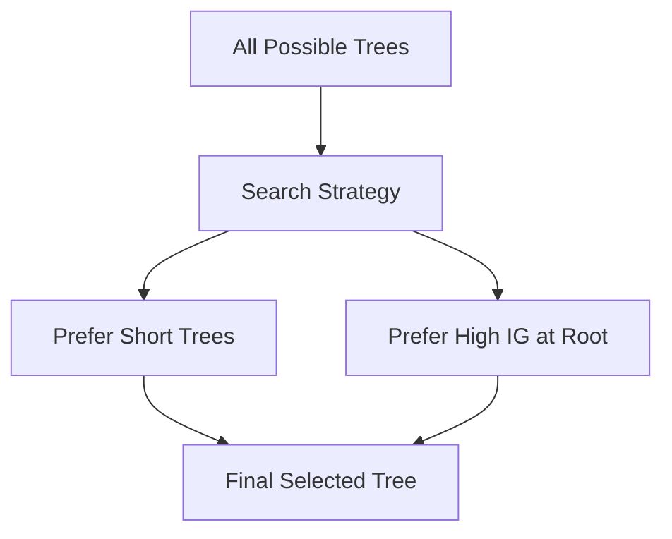
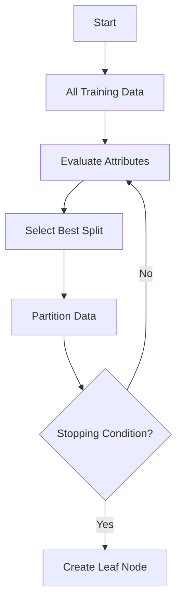

# Decision Tree Learning as a Search Problem

## 1. Introduction

Decision tree learning (e.g., ID3 algorithm) can be understood as:

> **A search through the space of all possible decision trees**

The goal is to find a tree that:
- Accurately classifies training data  
- Generalizes well to unseen data  

---

## 2. Search Strategy and Hypothesis Space

### 2.1 Hypothesis Space

- The hypothesis space = **all possible decision trees**
- This space is **very large**, but also **complete**

👉 Meaning:
- Any finite discrete function can be represented

---

### 2.2 Search Strategy

ID3 uses:

- **Top-down approach**
- **Greedy (hill-climbing) search**
- **Simple → complex model building**

---

### 2.3 Search Flow (Mermaid)
```mermaid
graph TD
A[Start with Full Dataset] --> B[Evaluate All Attributes]
    B --> C[Select Best Attribute<br/>(Max Information Gain)]
    C --> D[Split Dataset into Subsets]
    D --> E{Stopping Condition Met?}
    
    E -->|No| F[Repeat Recursively on Each Subset]
    F --> B
    
    E -->|Yes| G[Create Leaf Node]
```

---

## 3. Evaluation Function

### Information Gain

Used to select the best attribute:

$$
IG(S, A) = Entropy(S) - \sum_{v \in Values(A)} \frac{|S_v|}{|S|} Entropy(S_v)
$$

👉 Higher Information Gain = better split

---

## 4. Key Characteristics

### 4.1 Completeness of Hypothesis Space

* ID3 can represent **any finite discrete-valued function**
* No restriction on model expressiveness

---

### 4.2 Single Hypothesis Maintenance

* Maintains **only one tree at a time**
* Does NOT track all possible trees

👉 Contrast:

* Candidate-Elimination → keeps multiple hypotheses
* ID3 → keeps only the current best tree

---

### 4.3 No Backtracking (Greedy Nature)

* Once a split is chosen → **never changed**
* May lead to:

  * Local optimum ❌
  * Not global optimum

---

### 4.4 Robustness to Noise

* Uses **statistical measures over full dataset**
* Less sensitive to:

  * Individual errors
  * Noisy samples

---

## 5. Inductive Bias in Decision Trees

### 5.1 What is Inductive Bias?

> Inductive bias = assumptions used to generalize beyond training data

---

### 5.2 Types of Bias

| Type             | Description                         |
| ---------------- | ----------------------------------- |
| Restriction Bias | Limits hypothesis space             |
| Preference Bias  | Prefers some hypotheses over others |

---

### 5.3 ID3 Uses Preference Bias

* Does NOT restrict possible trees
* Instead, it prefers:

👉 Simpler trees over complex ones

---

## 6. Bias Behavior in ID3

### Preferences:

* Shorter trees
* High Information Gain attributes near root

---

### Mermaid Representation



---

## 7. Occam’s Razor Principle

> “Simpler models are more likely to be correct.”

### Why?

* Fewer simple hypotheses exist
* Less chance of fitting data by coincidence

---

### Intuition

| Model        | Risk                  |
| ------------ | --------------------- |
| Simple Tree  | Better generalization |
| Complex Tree | Overfitting           |

---

## 8. Why Preference Bias is Powerful

### Advantage over Restriction Bias

| Preference Bias             | Restriction Bias |
| --------------------------- | ---------------- |
| Flexible                    | Limited          |
| Can represent true function | May exclude it   |
| Guided by search            | Hard constraints |

---

👉 Decision trees:

* Explore full space
* But prioritize simpler solutions

---

## 9. Overall Search Process (Mermaid)



---

## 10. Summary

| Concept        | Description              |
| -------------- | ------------------------ |
| Search Space   | All possible trees       |
| Strategy       | Greedy, top-down         |
| Evaluation     | Information Gain         |
| Bias Type      | Preference bias          |
| Key Assumption | Simpler trees are better |

---

## 11. Conclusion

Decision tree learning:

* Searches a **complete hypothesis space**
* Uses a **greedy strategy**
* Relies on **preference bias (simplicity)**

> It does not limit what it can learn, but assumes that **simpler trees are more likely to generalize well**.
