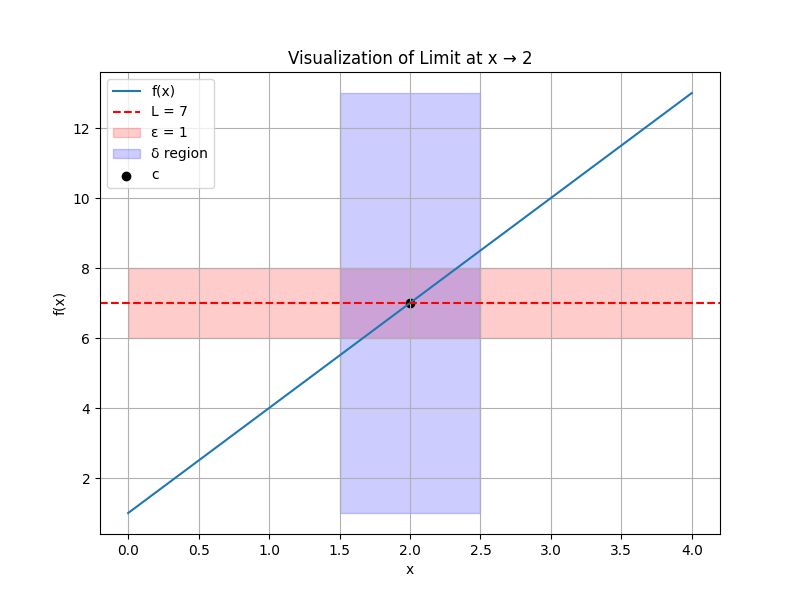
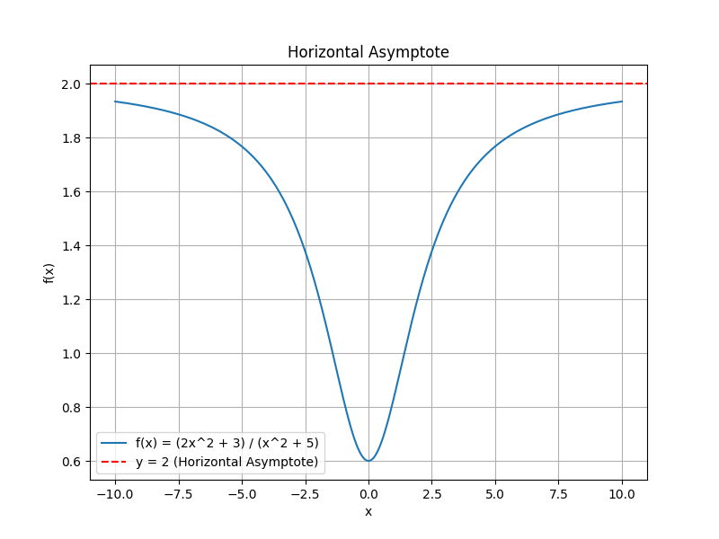

# Limits and Continuity

## 1. Precise Definition of Limit

### Definition:
The limit of a function \( f(x) \) as \( x \) approaches \( c \) is \( L \), written as:

\[ \lim_{{x \to c}} f(x) = L \]

This means that as \( x \) gets arbitrarily close to \( c \), the values of \( f(x) \) approach \( L \).

### \( \varepsilon-\delta \) Definition:
For every \( \varepsilon > 0 \), there exists a \( \delta > 0 \) such that if \( 0 < |x - c| < \delta \), then:
\[ |f(x) - L| < \varepsilon \]

### Intuition:
1. \( \varepsilon \): Controls how close \( f(x) \) needs to be to \( L \).
2. \( \delta \): Controls how close \( x \) needs to be to \( c \).

### Example:
#### Problem:

Prove \( \lim_{{x \to 2}} (3x + 1) = 7 \) using the \( \varepsilon-\delta \) definition.

#### Solution:
1. Given \( f(x) = 3x + 1 \), \( L = 7 \), \( c = 2 \).
2. We want \( |f(x) - L| < \varepsilon \):

	\[ |(3x + 1) - 7| = |3x - 6| = 3|x - 2| \]

3. To satisfy \( 3|x - 2| < \varepsilon \):

    \[ |x - 2| < \frac{\varepsilon}{3} \]

4. Choose \( \delta = \frac{\varepsilon}{3} \).

Whenever \( |x - 2| < \delta \), it follows that \( |f(x) - 7| < \varepsilon \).

### Python Visualization:
Below is a Python function to visualize the \( \delta-\varepsilon \) relationship for a given function and limit:

```python
import numpy as np
import matplotlib.pyplot as plt

def visualize_limit(f, c, L, epsilon):
    x = np.linspace(c - 2, c + 2, 1000)
    y = f(x)

    plt.figure(figsize=(8, 6))
    plt.plot(x, y, label=f"f(x)")
    plt.axhline(L, color='red', linestyle='--', label=f"L = {L}")
    plt.fill_between(x, L - epsilon, L + epsilon, color='red', alpha=0.2, label=f"ε = {epsilon}")

    delta_region = (x > c - epsilon / 2) & (x < c + epsilon / 2)
    plt.fill_between(x[delta_region], min(y), max(y), color='blue', alpha=0.2, label=f"δ region")

    plt.scatter([c], [L], color='black', label="c")
    plt.title(f"Visualization of Limit at x → {c}")
    plt.legend()
    plt.grid()
    plt.xlabel("x")
    plt.ylabel("f(x)")
	plt.savefig("limit.png")
    plt.show()

# Example: Visualize f(x) = 3x + 1, c = 2, L = 7, ε = 1
visualize_limit(lambda x: 3 * x + 1, c=2, L=7, epsilon=1)
```
<figure markdown='span'>
	
	<figcaption> Limit </figcaption>
</figure>

---

## 2. Continuity

### Definition:
A function \( f(x) \) is continuous at a point \( c \) if:
1. \( f(c) \) is defined.
2. \( \lim_{{x \to c}} f(x) \) exists.
3. \( \lim_{{x \to c}} f(x) = f(c) \).

### Types of Discontinuity:
1. **Removable Discontinuity**:
   The limit exists but \( f(c) \) is either undefined or does not match the limit.
2. **Jump Discontinuity**:
   The left-hand limit \( \lim_{{x \to c^-}} f(x) \) and the right-hand limit \( \lim_{{x \to c^+}} f(x) \) exist but are not equal.
3. **Infinite Discontinuity**:

    \( f(x) \) approaches infinity as \( x \to c \).

### Example:
#### Problem:
Determine whether \( f(x) = \frac{x^2 - 1}{x - 1} \) is continuous at \( x = 1 \).

#### Solution:
1. Simplify \( f(x) \):

	\[ f(x) = \frac{x^2 - 1}{x - 1} = \frac{(x - 1)(x + 1)}{x - 1} = x + 1, \quad x \neq 1 \]

2. \( f(1) \) is undefined (discontinuity).
3. The limit exists:

    \[ \lim_{{x \to 1}} f(x) = 1 + 1 = 2 \]

4. Discontinuity is removable; redefine \( f(1) = 2 \) to make it continuous.

---

## 3. Limit at Infinity: Horizontal Asymptotes

### Definition:

The limit of \( f(x) \) as \( x \to \infty \) or \( x \to -\infty \) describes the horizontal asymptotes of the function. If:

\[ \lim_{{x \to \infty}} f(x) = L \quad \text{or} \quad \lim_{{x \to -\infty}} f(x) = L \]

then \( y = L \) is a horizontal asymptote.

### Key Intuition:
At extreme values of \( x \), the function stabilizes around a constant value \( L \).

### Examples:
#### Example 1: Rational Function
\( f(x) = \frac{2x^2 + 3}{x^2 + 1} \)

#### Solution:
1. Divide numerator and denominator by \( x^2 \):

    \[ f(x) = \frac{2 + \frac{3}{x^2}}{1 + \frac{1}{x^2}} \]

2. As \( x \to \infty \), \( \frac{3}{x^2} \to 0 \) and \( \frac{1}{x^2} \to 0 \):

    \[ \lim_{{x \to \infty}} f(x) = \frac{2 + 0}{1 + 0} = 2 \]

3. Horizontal asymptote: \( y = 2 \).

#### Example 2: Exponential Function
\( f(x) = e^{-x} \)

#### Solution:
1. As \( x \to \infty \):

    \[ e^{-x} \to 0 \]

2. Horizontal asymptote: \( y = 0 \).

### Python Visualization:
```python
import numpy as np
import matplotlib.pyplot as plt

x = np.linspace(-10, 10, 1000)
y = (2 * x**2 + 3) / (x**2 + 5)

plt.figure(figsize=(8, 6))
plt.plot(x, y, label="f(x) = (2x^2 + 3) / (x^2 + 5)")
plt.axhline(2, color='red', linestyle='--', label="y = 2 (Horizontal Asymptote)")
plt.title("Horizontal Asymptote")
plt.legend()
plt.grid()
plt.xlabel("x")
plt.ylabel("f(x)")
# plt.savefig("image.png")
plt.show()
```
<figure markdown='span'>
	
	<figcaption> Asymptote </figcaption>
</figure>
This visualization demonstrates the behavior of \( f(x) \) as \( x \to \pm\infty \).

