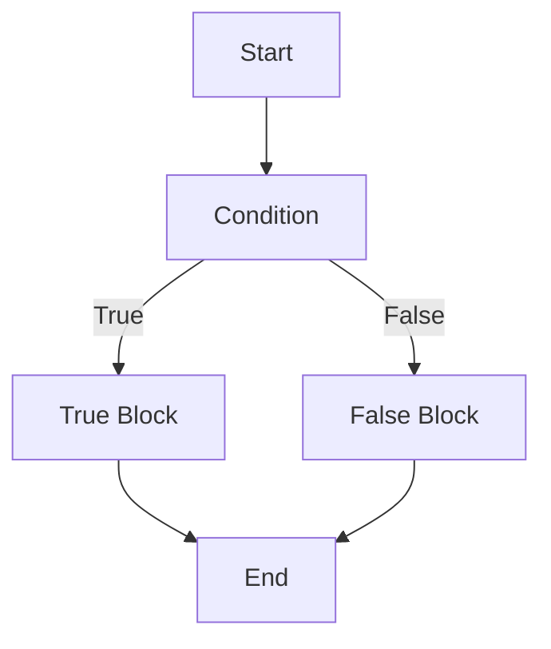
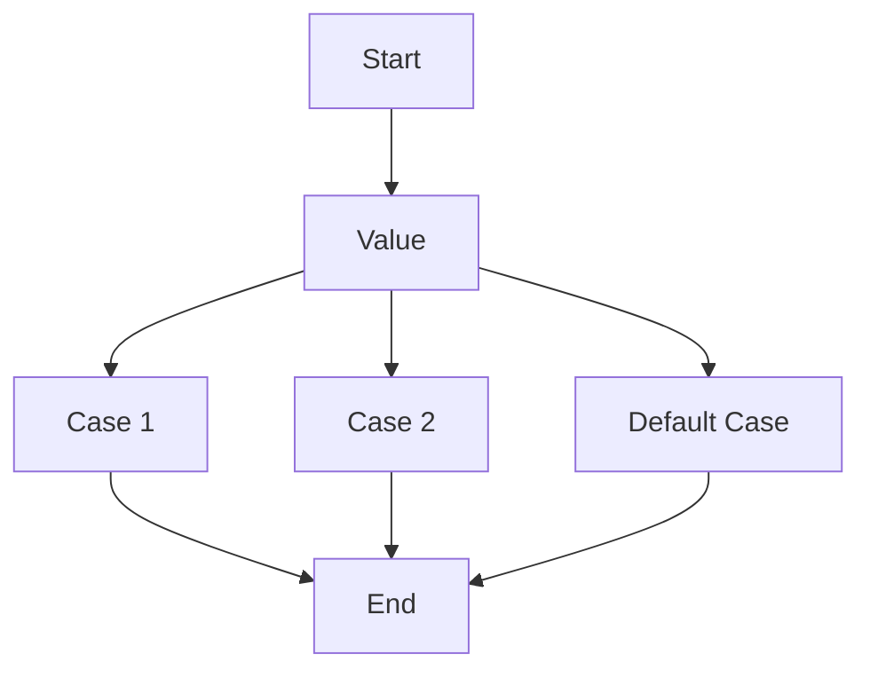
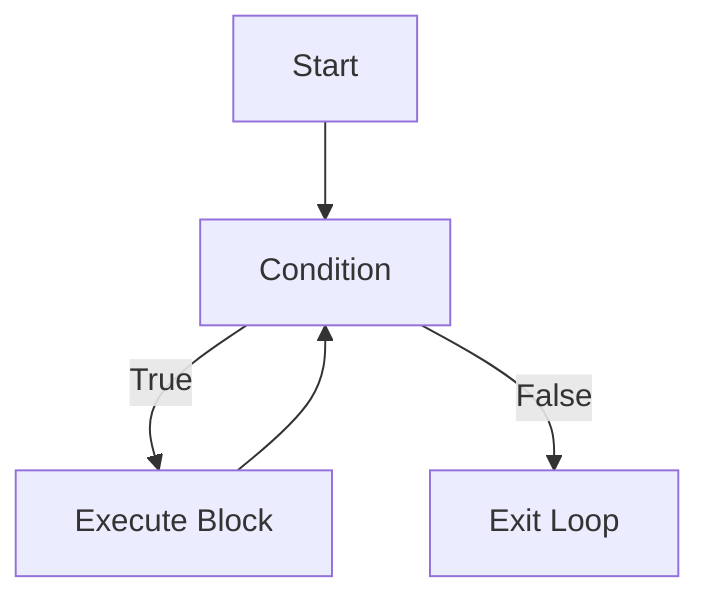
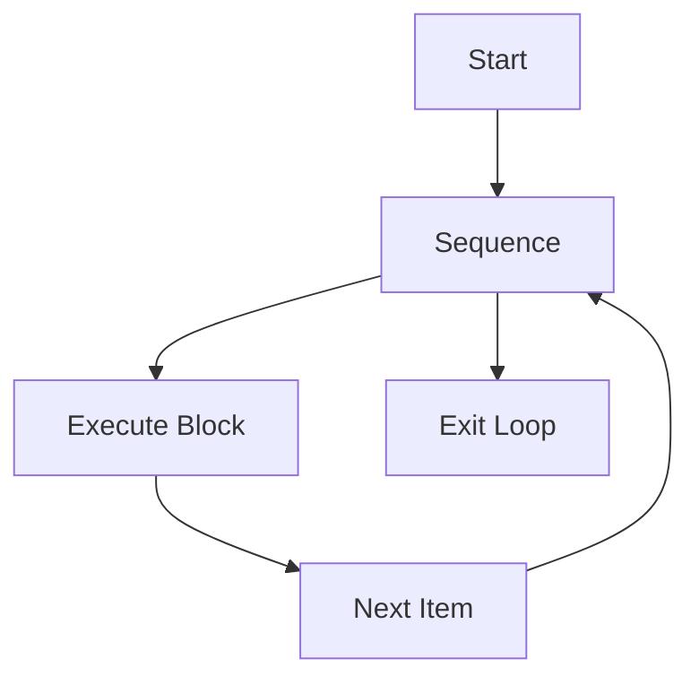

## Conditions and Loops in Python

Python provides intuitive ways to handle conditional statements and loops, enabling decision-making and repetition in programs. Below are detailed explanations and examples.

---

### **Conditional Statements**

Conditional statements allow decision-making by evaluating expressions and executing specific code blocks based on the results.

#### **1. if Statement**
The `if` statement executes a block of code if a specified condition is `True`.

```python
x = 10
if x > 5:
    print("x is greater than 5")
```
Output:
```python exec="on"
x = 10
if x > 5:
    print("x is greater than 5")
```

#### **2. if-else Statement**
The `if-else` statement provides an alternative block of code if the condition is `False`.

```python
x = 3
if x > 5:
    print("x is greater than 5")
else:
    print("x is less than or equal to 5")
```

#### **3. if-elif-else Statement**
The `if-elif-else` statement is used for multiple conditions.

```python
x = 7
if x > 10:
    print("x is greater than 10")
elif x > 5:
    print("x is greater than 5 but less than or equal to 10")
else:
    print("x is 5 or less")
```

#### **Flow Diagram for Conditional Statements**



---
##**match-case Statement in Python**

The `match-case` statement, introduced in Python 3.10, is a feature that allows **structural pattern matching**. It provides an elegant way to compare values or match patterns, similar to a `switch` statement in other languages, but with advanced capabilities like destructuring and conditions.

---

### **Syntax**

```python
match value:
    case pattern1:
        # Code block for pattern1
    case pattern2:
        # Code block for pattern2
    case _:
        # Default case (wildcard)
```

---

### **Examples**

#### **1. Simple match-case**
```python
def get_day_type(day):
    match day:
        case "Saturday" | "Sunday":
            return "Weekend"
        case "Monday" | "Tuesday" | "Wednesday" | "Thursday" | "Friday":
            return "Weekday"
        case _:
            return "Invalid day"

print(get_day_type("Sunday"))  # Output: Weekend
print(get_day_type("Friday"))  # Output: Weekday
```

---

#### **2. Matching with Conditions**
```python
def describe_number(num):
    match num:
        case x if x > 0:
            return "Positive"
        case x if x < 0:
            return "Negative"
        case _:
            return "Zero"

print(describe_number(10))  # Output: Positive
print(describe_number(-5))  # Output: Negative
print(describe_number(0))   # Output: Zero
```

---

#### **3. Destructuring Tuples**
```python
def describe_point(point):
    match point:
        case (0, 0):
            return "Origin"
        case (x, 0):
            return f"Point on X-axis at {x}"
        case (0, y):
            return f"Point on Y-axis at {y}"
        case (x, y):
            return f"Point at ({x}, {y})"
        case _:
            return "Not a point"

print(describe_point((0, 0)))    # Output: Origin
print(describe_point((3, 0)))    # Output: Point on X-axis at 3
print(describe_point((0, -2)))   # Output: Point on Y-axis at -2
print(describe_point((2, 3)))    # Output: Point at (2, 3)
```

---

#### **4. Matching Lists**
```python
def process_list(items):
    match items:
        case []:
            return "Empty list"
        case [x]:
            return f"Single item: {x}"
        case [x, y]:
            return f"Two items: {x}, {y}"
        case [x, *rest]:
            return f"First item: {x}, Rest: {rest}"

print(process_list([]))           # Output: Empty list
print(process_list([10]))         # Output: Single item: 10
print(process_list([1, 2]))       # Output: Two items: 1, 2
print(process_list([1, 2, 3, 4])) # Output: First item: 1, Rest: [2, 3, 4]
```

---

#### **5. Matching Dictionaries**
```python
def check_config(config):
    match config:
        case {"debug": True}:
            return "Debugging enabled"
        case {"debug": False}:
            return "Debugging disabled"
        case _:
            return "No debug key found"

print(check_config({"debug": True}))   # Output: Debugging enabled
print(check_config({"debug": False}))  # Output: Debugging disabled
print(check_config({"version": "1.0"})) # Output: No debug key found
```

---

### **Flow Diagram**



---

### **Advantages**

1. **Improved Readability**: Cleaner and more structured than complex `if-elif` chains.
2. **Flexible Matching**: Supports destructuring, wildcards, and conditions.
3. **Default Handling**: The `_` case acts as a fallback for unmatched patterns.

---

### **Limitations**

- Requires Python 3.10 or later.
- Overhead for very simple condition checks compared to `if-elif`.

---

The `match-case` statement is particularly useful for applications like parsing structured data, handling enums, or processing complex conditions in a readable way. It adds a significant level of expressiveness and power to Python's pattern-matching capabilities.

### **Loops**

Loops are used to repeat a block of code multiple times.

#### **1. while Loop**
The `while` loop executes as long as the condition is `True`.

```python
count = 0
while count < 5:
    print(f"Count is {count}")
    count += 1
```

#### **2. for Loop**
The `for` loop iterates over a sequence (like a list, tuple, or range).

```python
for i in range(5):
    print(f"Iteration {i}")
```

#### **3. Nested Loops**
Loops can be nested inside each other.

```python
for i in range(3):
    for j in range(2):
        print(f"Outer loop {i}, Inner loop {j}")
```

#### **4. Loop Control Statements**
- **break**: Exits the loop.
- **continue**: Skips the current iteration.
- **pass**: Does nothing (a placeholder).

```python
for i in range(5):
    if i == 3:
        break
    elif i == 2:
        continue
    print(i)
```

#### **Flow Diagrams for Loops**

##### While Loop


##### For Loop


---

### **Conclusion**

Conditional statements and loops are core concepts in Python, enabling flexible and dynamic programming. The flow diagrams above help visualize the logic and execution flow, making it easier to understand and implement these constructs in your programs.