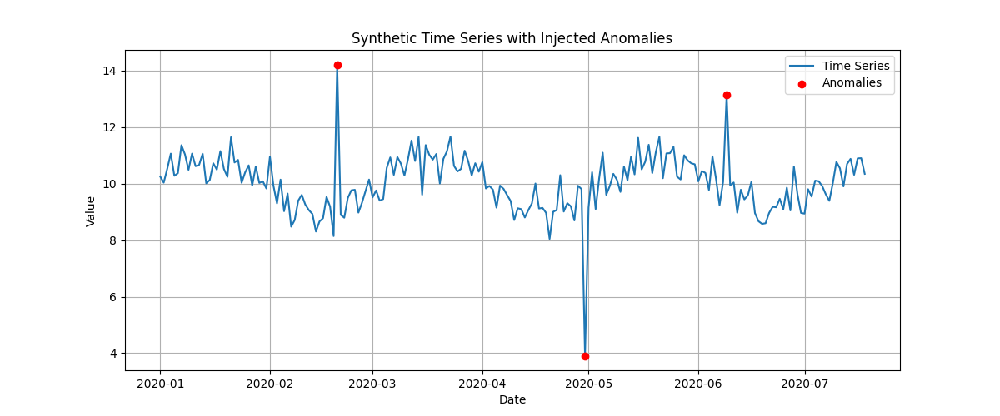

# Anomaly Detection in Time Series

### 🧠 Concept Overview

Anomaly detection involves identifying unexpected or rare patterns in time series data. These may signal:

* Faults in a system
* Outliers in sensor readings
* Irregular activity (e.g., fraud, system failures)

---

### 📐 Mathematical Techniques

#### 1. **Z-score Method**

Given a series $x_t$, the Z-score is:

$$
z_t = \frac{x_t - \mu}{\sigma}
$$

* Where $\mu$ and $\sigma$ are the rolling mean and standard deviation.

Anomalies are detected where $|z_t| > \text{threshold}$.

#### 2. **Moving Average and Thresholding**

$$
\text{Anomaly if } |x_t - \text{MA}_t| > k \cdot \text{std}_t
$$

#### 3. **Seasonal Hybrid ESD (S-H-ESD)** and model-based techniques (e.g., Isolation Forest, Autoencoders) for advanced use.

---

### 🧪 Example: Z-score Anomaly Detection

```python
window = 20
df['rolling_mean'] = df['Value'].rolling(window).mean()
df['rolling_std'] = df['Value'].rolling(window).std()
df['z_score'] = (df['Value'] - df['rolling_mean']) / df['rolling_std']

# Mark anomalies
threshold = 3
df['anomaly'] = df['z_score'].abs() > threshold
```

---

### 📊 Visualize Detected Anomalies

```python
plt.figure(figsize=(12, 5))
plt.plot(df.index, df['Value'], label='Time Series')
plt.scatter(df.index[df['anomaly']], df['Value'][df['anomaly']],
            color='red', label='Anomalies', zorder=5)
plt.title("Z-score Based Anomaly Detection")
plt.xlabel("Date")
plt.ylabel("Value")
plt.legend()
plt.grid(True)
plt.tight_layout()
plt.show()
```


## Sample Data and Anamoly Detection

### Let's begin generating the notebook content for "Anomaly Detection in Time Series" , We'll create a sample dataset and plot it with anomalies marked
```python
import pandas as pd
import numpy as np
import matplotlib.pyplot as plt

# Generate a time series with some noise
np.random.seed(42)
date_range = pd.date_range(start="2020-01-01", periods=200, freq="D")
data = 10 + np.sin(np.linspace(0, 20, 200)) + np.random.normal(0, 0.5, 200)

# Inject anomalies
anomalies = [50, 120, 160]
data[anomalies] += np.array([5, -6, 4])

# Create DataFrame
df = pd.DataFrame({"Date": date_range, "Value": data})
df.set_index("Date", inplace=True)

# Plot with anomalies marked
plt.figure(figsize=(12, 5))
plt.plot(df.index, df["Value"], label="Time Series")
plt.scatter(df.index[anomalies], df["Value"].iloc[anomalies], color='red', label="Anomalies", zorder=5)
plt.title("Synthetic Time Series with Injected Anomalies")
plt.xlabel("Date")
plt.ylabel("Value")
plt.legend()
plt.grid(True)
plt.savefig("synthetic_time_series_anomalies.png")
plt.tight_layout()
plt.show()

```

