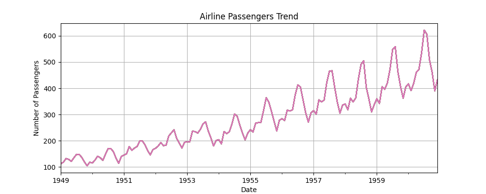

# Time Series Analysis: Fundamentals

## What is a Time Series?

A **time series** is a sequence of data points collected or recorded at successive points in time. These data points are typically spaced at uniform intervals such as hourly, daily, monthly, or yearly.

### Examples:

* Daily stock prices
* Monthly airline passengers
* Hourly temperature readings
* Annual GDP of a country

Time series data allow us to:

* Analyze past trends
* Forecast future values
* Understand underlying processes

---

## Components of Time Series

Time series data can often be decomposed into several underlying components. Understanding these components helps in better analysis and forecasting.

### 1. Trend

The **trend** component represents the long-term progression of the series. It shows whether the data is increasing, decreasing, or remaining constant over time.

**Example**: A steady rise in housing prices over several years.


```python 
import pandas as pd
import matplotlib.pyplot as plt

# Load sample time series data
url = 'https://raw.githubusercontent.com/jbrownlee/Datasets/master/airline-passengers.csv'
df = pd.read_csv(url, parse_dates=['Month'], index_col='Month')

# Plot trend
df['Passengers'].plot(title='Airline Passengers Trend', figsize=(10, 4))
plt.xlabel('Date')
plt.ylabel('Number of Passengers')
plt.grid(True)
plt.show()
```

<!-- ```python exec="on"
import pandas as pd
import matplotlib.pyplot as plt

# Load sample time series data
url = 'https://raw.githubusercontent.com/jbrownlee/Datasets/master/airline-passengers.csv'
df = pd.read_csv(url, parse_dates=['Month'], index_col='Month')

# Plot trend
df['Passengers'].plot(title='Airline Passengers Trend', figsize=(10, 4))
plt.xlabel('Date')
plt.ylabel('Number of Passengers')
plt.grid(True)
plt.show()
# Save figure 
plt.savefig('airline_passengers_trend.png')
``` -->



### 2. Seasonality

**Seasonality** refers to periodic fluctuations that occur at regular intervals due to seasonal factors such as weather, holidays, or recurring events.

**Example**: Increase in ice cream sales during summer.

```python
from statsmodels.tsa.seasonal import seasonal_decompose

# Decompose the time series
result = seasonal_decompose(df['Passengers'], model='multiplicative')
result.seasonal.plot(title='Seasonality Component')
plt.show()
```

### 3. Cyclicity

**Cyclic** behavior occurs when data exhibit rises and falls that are not of fixed period and are often related to economic or business cycles.

**Example**: Economic expansions and recessions over decades.

Cyclic patterns are harder to identify with short datasets, but long-term datasets may reveal cycles distinct from seasonality.

```python
# Plot full decomposition to see cycle trends (if any)
result.plot()
plt.suptitle('Time Series Decomposition', fontsize=16)
plt.show()
```

### 4. Noise (Residuals)

**Noise** is the random variation in the data that cannot be attributed to trend, seasonality, or cycles. It is considered unpredictable and should ideally be minimized.

**Example**: Unexplained spikes in sales due to random events.

```python
# Plot residual (noise)
result.resid.plot(title='Noise/Residuals Component')
plt.show()
```

---

## Time Series vs Cross-Sectional Data

| Feature    | Time Series Data                 | Cross-Sectional Data                             |
| ---------- | -------------------------------- | ------------------------------------------------ |
| Definition | Observations collected over time | Observations collected at a single point in time |
| Focus      | Temporal ordering of data        | Comparison among units (e.g., people, regions)   |
| Example    | Daily temperature over a year    | Temperature readings across cities on one day    |

**Key Difference**: Time series analysis emphasizes the **order and time-dependence** of observations, whereas cross-sectional analysis looks at differences between subjects **at the same point in time**.

---

## Stationarity & White Noise

### Stationarity

A time series is **stationary** if its statistical properties (mean, variance, autocorrelation) are constant over time. Most forecasting methods require the data to be stationary.

#### Types of Stationarity:

* **Strict stationarity**: Distribution does not change over time.
* **Weak stationarity**: Mean, variance, and autocovariance are time-invariant.

**Why important?** Stationary series are easier to model and forecast.

#### Checking Stationarity:

```python
from statsmodels.tsa.stattools import adfuller

# Perform Augmented Dickey-Fuller test
adf_result = adfuller(df['Passengers'])
print(f"ADF Statistic: {adf_result[0]}")
print(f"p-value: {adf_result[1]}")
```

#### Making a Series Stationary:

```python
df['diff'] = df['Passengers'].diff()
df['diff'].dropna().plot(title='Differenced Series')
plt.show()
```

### White Noise

**White noise** is a series of random variables that:

* Have constant mean and variance
* Have zero autocorrelation at all lags

White noise is purely random and unpredictable. It's often used as a benchmark to determine whether a time series model has successfully captured the structure of a time series.

```python
import numpy as np

# Generate white noise series
np.random.seed(42)
white_noise = np.random.normal(loc=0, scale=1, size=100)
plt.plot(white_noise)
plt.title('White Noise Time Series')
plt.show()
```

---

Next Sections (optional extensions):

* Measuring Autocorrelation
* Decomposing Time Series in Python
* Augmented Dickey-Fuller Test
* Rolling Windows & Differencing

* Rolling Windows & Differencing
